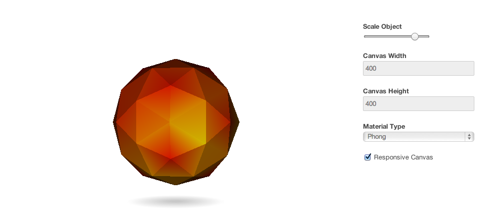

<DemoSource
  demo="http://winkervsbecks.github.io/angularWebglDirective"
  source="https://github.com/winkerVSbecks/angularWebglDirective"
/>

AngularJS directives are siloed reusable components. This is an example of a WebGL directive built using [three.js](http://threejs.org/). You can pass setup information such as: canvas size, model size, material, lighting, etc. to the directive.

You can even bind these values to the WebGL context – use the controls below to resize the object or change it's material type.

Events such as window resizing or mouse moved can also be bound to the directive to update the scene. With the Responsive Canvas checkbox selected try resizing the window. The canvas and the scene will resize to fit the container.
