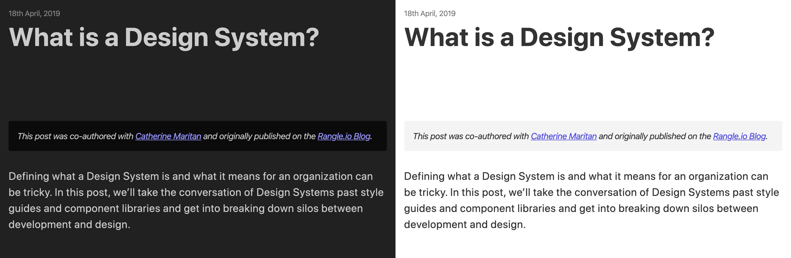
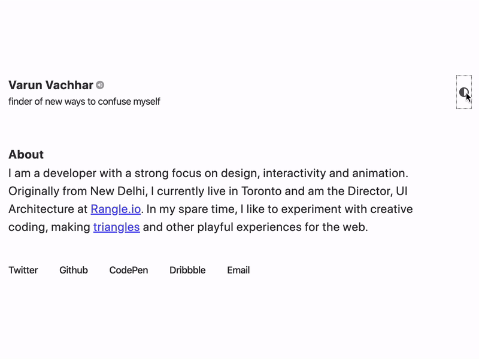

import DarkModeAnimation from './dark-mode-animation';
import ColorScale from './color-scale';
import JsToCssVars from './js-to-css-vars';

<Box
  width={24 * 2.5}
  height={24 * 2.5}
  ml="auto"
  mr="auto"
  mb={6}
  overflow="hidden"
>
  <DarkModeAnimation />
</Box>

After several years of using Jekyll, I switched over my website to Gatsby. Jekyll worked great for most things. The part that I struggled with most was adding interactivity. The best I could do was embed CodePen blocks in markdown. Gatsby gives you all the benefits of static rendering and craft amazing interactive experiences with React. Josh Comeau's [Dynamic Bézier Curves post](https://www.joshwcomeau.com/posts/dynamic-bezier-curves/) or Rodrigo Pombo's [scrollycoding](https://twitter.com/pomber/status/1191784048152195075?s=20) are good examples of this.

There is much out there about [migrating to Gatsby](https://julesforrest.com/moving-to-gatsby), the benefits and the trade-offs. I want to focus on one particular challenge of my migration — dark mode. Dark themes are certainly a bit of a trend, but it also happens to be a feature many users rely on on a day-to-day basis. Most devices support it at the OS level. The user preference even cascades down to the browser and can be captured in CSS via the `prefers-color-scheme` media query.

## Colour Palette

The first step was to pick a colour palette. Inverting shades using `filter: invert(100%)` is a quick and somewhat hacky way to get to dark mode. You can follow [Daniel Eden's](https://mobile.twitter.com/_dte) advice and pair it with `hue-rotate(180deg)` for a better result. It compensates for the hue inversion. However, there is a lot more to it. Inverting hues can lead to unintended consequences such as poor contrast or shifting visual importance of UI elements. We need to be a lot more intentional about the colour palette.



Teresa Man shared extremely valuable advice in her post, [How to design delightful dark themes](https://blog.superhuman.com/how-to-design-delightful-dark-themes-7b3da644ff1f). Here are some of the key learnings that I applied to my website:

1. Avoid pure black or white. It can lead to eye fatigue and causes [black smearing](https://twitter.com/marcedwards/status/1053519077958803456).
2. Darken distant surfaces.
3. Reduce large blocks of bright colour.

There are two categories in the colour palette: neutral scale, used for most things such as text and surface colours, and brand colours, used only used for highlights and accents.

<ColorScale />

Taking Teresa's advice, the extreme ends of the neutral scale are a blue-ish black and a light gray. The background is set to `neutral.7`, and other surfaces such as code-blocks all are set to a lighter `neutral.6`.

## Implementation

I was going for an end experience where my site supports two modes — dark and light. On the first load it defaults to the light mode. It then checks to see if the user prefers dark mode using `prefers-color-scheme: dark` media query. If yes, then switch to dark mode. There is also a button that the user can click to toggle modes. On subsequent loads the site needs to track their choice, default to it.

On the surface this seems like a failry straightforward feature set. Howver, I soon discovered that there was a lot of hidden complexity I wasn't accounting for. I'll go through those challenges in a bit but first, I want to give a major shout out to the [Theme UI](https://theme-ui.com/) team. My solution is largely based on how Theme UI handles [colour mode](https://theme-ui.com/color-modes#setting-the-color-mode) switching. This blog post could easily have been titled "How Theme UI handles colour mode switching with Gatsby".

### Theme Variants

I'm using [Styled System](https://styled-system.com/) paired with [styled-components](https://www.styled-components.com) for the UI. styled-components provides theming support through its `<ThemeProvider>` component. I created the dark and light variants and choose the appropriate theme based on the active mode.



### Tracking User choice

The `useColorMode` hook allows us to track the active colour mode. On the first load it checks to see if the user's choice is stored in local storage or if the user has enabled dark mode at their OS level. When updating the selected mode there a couple of side-effects that need to happen:

1. Set a class on the `body` element reflecting the active mode, for example, `varun-ca-dark`
2. Save the active mode in local-storage
3. Update state

```js:title=use-color-mode.js
export const useColorMode = () => {
  const [mode, setMode] = useState('light');

  useEffect(() => {
    const stored = storage.get();
    const dark = getMediaQuery();
    if (!stored && dark) return setModeWithSideEffects('dark');
    if (!stored || stored === mode) return;
    setModeWithSideEffects(stored);
  }, []);

  const setModeWithSideEffects = () => {
    setMode(state => {
      const nextMode = state === 'light' ? 'dark' : 'light';
      document.body.classList.remove('varun-ca-' + state);

      document.body.classList.add('varun-ca-' + nextMode);
      storage.set(nextMode);

      return nextMode;
    });
  };

  return [mode, setModeWithSideEffects];
};
```

Check out [use-color-mode.js](https://github.com/winkerVSbecks/varun.ca/blob/master/src/use-color-mode.js) for more context.

My site has a base layout that I use for all pages, the `layout.js` file. It essentially acts at the root of the application and the themeing set up is done there. The active `mode` is used to generate the appropriate theme object and passed into the `ThemeProvider`.

To allow the user to select the colour-mode manually, we need to connect the `mode` state and updater to the toggle button. React's context API works perfectly for this. The `ColorModeContext` provides `{ mode, setColorMode }` which is then used by the [CycleMode](https://github.com/winkerVSbecks/varun.ca/blob/master/src/components/cycle-mode.js) button.

```js:title=layout.js
const Layout = ({ title, description, image, children }) => {
  const [mode, setColorMode] = useColorMode();

  return (
    <ThemeProvider theme={{ ...theme, ...createColorStyles(mode) }}>
      <ColorModeContext.Provider value={{ mode, setColorMode }}>
        <>
          <SEO title={title} description={description} image={image} />
          <InitializeColorMode />
          <GlobalStyle />
          <MDXProvider components={dsToMdx}>{children}</MDXProvider>
        </>
      </ColorModeContext.Provider>
    </ThemeProvider>
  );
};
```

### Avoiding Flash

Gatsby, at build time, uses a React server-side rendering to compile the site into files that can be delivered to a web browser. The output is HTML and a JavaScript runtime that takes over in the browser once the initial HTML has loaded.


The generated HTML and CSS use the default colour mode. When the user loads the page, it renders with that default colour mode. Once the JS loads, it updates the CSS to match the user's preferred choice. This switch causes the page to flash between the two styles. Not a great user experience!

The best way to avoid _the flash_ is to rely on CSS rather than JavaScript. The challenge here is that styled-components is a CSS-in-JS library and relies on the JS bundle to load and parse before the CSS can be appropriately updated. The Theme UI team came up with an innovative solution.

First, convert the colour modes from hard-coded hex values to CSS Custom Properties. Then generate global CSS that controls the value of these CSS Custom Properties using scoped class names, for example: `.varun-ca-dark` and `.varun-ca-light` ([color-mode-styles.js](https://github.com/winkerVSbecks/varun.ca/blob/master/src/theme/color-mode-styles.js)).

<JsToCssVars />

Lastly, inject a tiny script in your HTML to check local-storage for the user’s preference and set the appropriate class name to the body tag ([use-color-mode.js](https://github.com/winkerVSbecks/varun.ca/blob/master/src/use-color-mode.js)).

```js:title=use-color-mode.js
const STORAGE_KEY = 'varun-ca-color-mode';

export const InitializeColorMode = () => (
  <script
    key="varun-ca-no-flash"
    dangerouslySetInnerHTML={{
      __html: `(function() { try {
        var mode = localStorage.getItem('${STORAGE_KEY}');
        if (!mode) return
        document.body.classList.add('varun-ca-' + mode);
      } catch (e) {} })();`,
    }}
  />
);
```

We are still using Styled-Components for theming. However, the values point to CSS custom properties, and we can switch the theme by changing the class on the `body` element. Since all the variable values are in global CSS, and the above script runs as soon as the page loads, the user no longer sees a flash. The only time the user sees a flash is the first time they visit your site, and if they have enabled dark mode on their OS.

Gatsby does a tremendous amount of work to ensure that your site is performant. One of those things is to use React SSR to generate a static website. It, unfortunately, means that we have to do a bit more work to implement dark mode, but the trade-off was worth it, and I got to learn a lot. That said, if you use [Theme UI](https://theme-ui.com/), then you get all of this for free.

The one key takeaway from this whole process is that implementing dark-mode means that you are creating more work for your future self. Each feature you add to your site will have to support it.
