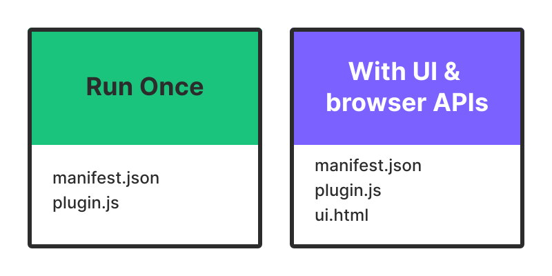
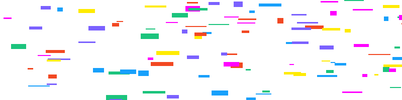
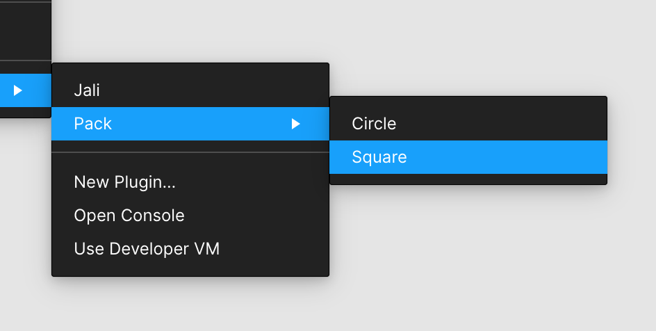
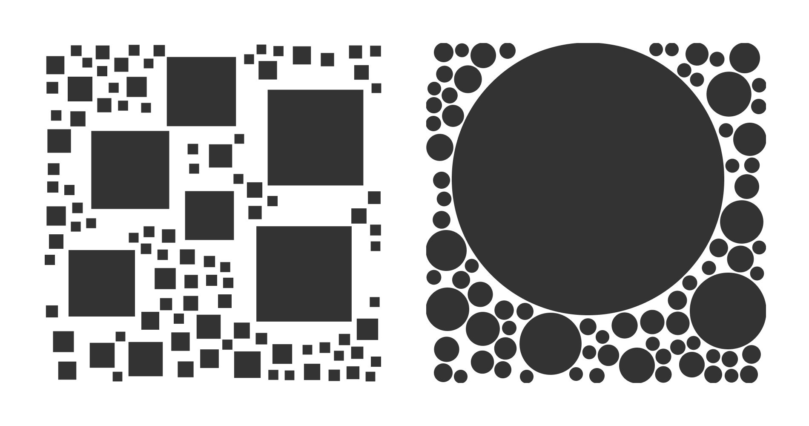
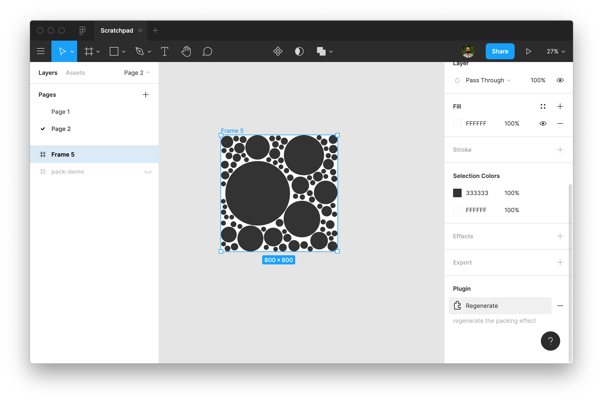

import pluginUi from '../assets/plugin-ui.png';

Figma plugins extend the core product's functionality and allow designers to enhance and automate their workflow. Building a plugin is relatively approachable. The shape of a plugin is quite similar to that of a website. However, it is a significant jump to go from making your first plugin to writing one that tackles a more sophisticated user problem. In this post, I'm going to break down the architecture of Figma plugins and describe how to use [figplug](https://rsms.me/figplug) to reduce some of the tooling complexity.

> If you can code a webpage with basic HTML and JavaScript, you can build a Figma plugin.

That's the motto that the Figma team adopted when designing their plugin [API](https://developer.mozilla.org/en-US/docs/Glossary/API). I'm focusing on designers here. Instead of relying on engineers, I want you to be able to build plugins for yourself. I'm going to assume familiarity with HTML, CSS and JavaScript. However, I will try my best to explain the modern JavaScript ecosystem and the various tools you are likely to encounter when writing plugins.

If you have never created a plugin, start with this [tutorial](https://www.figma.com/plugin-docs/setup/) first.

## What's in a Plugin?

A website is an HTML page that runs in the browser. You can use CSS to control the visual styling of the page and JavaScript to handle user interactions.

Similarly, a Figma plugin is a little website that runs inside Figma… kind of. The plugin has two parts:

- **Main Plugin Code —** JavaScript code that can interact with the Figma file, modify its contents or generate new content.
- **Optional UI —** an iframe that renders the UI associated with your plugin, inputs, sliders, buttons, etc.

The diagram below visualizes a Figma plugin, click to step through the explanation.

<Embed
  style="border: none;"
  width="100%"
  height="550"
  src="https://www.figma.com/embed?embed_host=share&url=https%3A%2F%2Fwww.figma.com%2Fproto%2FIlQnd9MJTFvzt1M67anyXo%2FFigma-Plugin-Architecture%3Fnode-id%3D65%253A0%26scaling%3Dscale-down-width"
  allowfullscreen
></Embed>

## The Shape of a Plugin

Plugins fall into two categories:

- **Run Once —** doesn't require the user to interact with the plugin after it runs once.
- **With UI & browser APIs —** allows users to interact with your plugin and provides access to the full set of browser APIs like `<canvas>` and network.



Where:

- `manifest.json` — metadata that describes your plugin. Its name, version of the plugin API you want to use, what file has the main plugin code and what file has the UI code.
- `plugin.js` — the main Javascript code of your plugin.
- `ui.html` (optional) — the UI associated with your plugin. You can write inline CSS and JavaScript or load it from other `.css` and `.js` files.

### Example



Throughout this post, I'll build out the Confetti plugin. It draws a bunch of confetti in a selected frame. The manifest file looks something like this:

```json:title=manifest.json
{
  "name": "Confetti",
  "id": "737805260747778092",
  "api": "1.0.0",
  "main": "plugin.js"
}
```

The ID property will be provided to you by Figma, through the _Create new Plugin_ feature.

```js:title=plugin.js
// Draw the confetti
createConfetti();

// Make sure to close the plugin when you're done. Otherwise the plugin will
// keep running, which shows the cancel button at the bottom of the screen.
figma.closePlugin();

function createConfetti() {
  // Make sure the user has only selected one node
  if (figma.currentPage.selection.length !== 1) {
    console.error('error: select a frame to render into');
  }

  const frameNode = figma.currentPage.selection[0];

  // Ensure that the selected node is a frame
  if (frameNode.type !== 'FRAME') {
    console.error('error: select a frame to render into');
  }

  const colors = [
    { r: 0.094, g: 0.627, b: 0.984 },
    { r: 0.482, g: 0.38, b: 1 },
    { r: 1, g: 0, b: 1 },
    { r: 0.105, g: 0.768, b: 0.49 },
    { r: 0.949, g: 0.282, b: 0.133 },
    { r: 1, g: 0.921, b: 0 },
  ];

  const width = frameNode.width;
  const height = frameNode.height;

  const randomRange = (low, high) => Math.floor(Math.random() * high) + low;
  const randomColor = () => colors[Math.floor(Math.random() * colors.length)];

  for (let index = 0; index < 50; index++) {
    // Create a rectangle
    const rect = figma.createRectangle();

    // Assign a random width and height to the rectangle
    const w = randomRange(width * 0.01, width * 0.05);
    const h = randomRange(height * 0.01, height * 0.05);
    rect.resize(w, h);

    // Randomly position the rectangle within the frame
    rect.x = randomRange(0, width);
    rect.y = randomRange(0, height);

    // Set a random color
    rect.fills = [
      {
        type: 'SOLID',
        color: randomColor(),
      },
    ];

    // Add the rectangle to the frame
    frameNode.appendChild(rect);
  }
}
```

The above plugin allows the user to select a frame and render 50 rectangles within it, with random size, location and colour. It picks from a list of six predefined colours. What if you wanted to allow the user to define a colour palette or control the number of rectangles? For that, we would need to add in the plugin UI.

### Creating a User Interface

Create an HTML file containing the markup for your UI and then modify the manifest file to add the UI property. Notice the `postMessage` here. When the user clicks on the button, we grab the rectangle count and send a message to the main plugin code.

```html{14-17}:title=ui.html
<p>
  <label>Number of rectangles:</label>
  <input id="number" value="50" />
</p>

<p>
  <button id="draw">Draw Confetti</button>
</p>

<script>
  document.querySelector('#draw').onclick = () => {
    const count = document.querySelector('#number').value;

    parent.postMessage(
      { pluginMessage: { type: 'create-confetti', count: Number(count) } },
      '*'
    );
  };
</script>
```

```json{6}:title=manifest.json
{
  "name": "Confetti",
  "id": "737805260747778092",
  "api": "1.0.0",
  "main": "plugin.js",
  "ui": "ui.html"
}
```

<Embed
  style="border: none;"
  width="100%"
  height="550"
  src="https://www.figma.com/embed?embed_host=share&url=https%3A%2F%2Fwww.figma.com%2Fproto%2FIlQnd9MJTFvzt1M67anyXo%2FFigma-Plugin-Architecture%3Fnode-id%3D272%253A109%26scaling%3Dscale-down-width"
  allowfullscreen
></Embed>

We need to make a few modifications to the plugin code too. We start by telling Figma to show the UI. Then we register a listener for messages. This listener is going to receive all messages from the UI. If the right type of message comes along, then we draw the confetti and close the plugin.

```js{1,3,5,10}:title=plugin.js
figma.showUI(__html__);

figma.ui.onmessage = msg => {
  if (msg.type === 'create-confetti' && typeof msg.count == 'number') {
    createConfetti(msg.count);
  }

  // Make sure to close the plugin when you're done. Otherwise the plugin will
  // keep running, which shows the cancel button at the bottom of the screen.
  figma.closePlugin();
};

function createConfetti(count) {
  // Make sure the user has only selected one node
  if (figma.currentPage.selection.length !== 1) {
    console.error('error: select a frame to render into');
  }

  const frameNode = figma.currentPage.selection[0];

  // Ensure that the selected node is a frame
  if (frameNode.type !== 'FRAME') {
    console.error('error: select a frame to render into');
  }

  const colors = [
    { r: 0.094, g: 0.627, b: 0.984 },
    { r: 0.482, g: 0.38, b: 1 },
    { r: 1, g: 0, b: 1 },
    { r: 0.105, g: 0.768, b: 0.49 },
    { r: 0.949, g: 0.282, b: 0.133 },
    { r: 1, g: 0.921, b: 0 },
  ];

  const width = frameNode.width;
  const height = frameNode.height;

  const randomRange = (low, high) => Math.floor(Math.random() * high) + low;
  const randomColor = () => colors[Math.floor(Math.random() * colors.length)];

  for (let index = 0; index < count; index++) {
    // Create a rectangle
    const rect = figma.createRectangle();

    // Assign a random width and height to the rectangle
    const w = randomRange(width * 0.01, width * 0.05);
    const h = randomRange(height * 0.01, height * 0.05);
    rect.resize(w, h);

    // Randomly position the rectangle within the frame
    rect.x = randomRange(0, width);
    rect.y = randomRange(0, height);

    // Set a random color
    rect.fills = [
      {
        type: 'SOLID',
        color: randomColor(),
      },
    ];

    // Add the rectangle to the frame
    frameNode.appendChild(rect);
  }
}
```

### Displaying Errors

So far, we have seen how to send messages from the iframe to the sandbox. This allows us to get information from the user or other sources (via network requests) and send that to our plugin. There are also going to be scenarios where you want to send information from the sandbox to the iframe. For example, to display errors encountered by the plugin.

<Embed
  style="border: none;"
  width="100%"
  height="550"
  src="https://www.figma.com/embed?embed_host=share&url=https%3A%2F%2Fwww.figma.com%2Fproto%2FIlQnd9MJTFvzt1M67anyXo%2FFigma-Plugin-Architecture%3Fnode-id%3D311%253A152%26scaling%3Dscale-down-width"
  allowfullscreen
></Embed>

In the plugin code, replace `console.error` with `postMessage` to dispatch errors to the UI.

```js{20-23,32-35}:title=plugin.js
figma.showUI(__html__);

figma.ui.onmessage = msg => {
  let status;

  if (msg.type === 'create-confetti' && typeof msg.count == 'number') {
    status = createConfetti(msg.count);
  }

  // Make sure to close the plugin when you're done. Otherwise the plugin will
  // keep running, which shows the cancel button at the bottom of the screen.
  if (status !== 'error') {
    figma.closePlugin();
  }
};

function createConfetti(count) {
  // Make sure the user has only selected one node
  if (figma.currentPage.selection.length !== 1) {
    figma.ui.postMessage({
      type: 'error',
      value: 'select a frame to render into',
    });

    return 'error';
  }

  const frameNode = figma.currentPage.selection[0];

  // Ensure that the selected node is a frame
  if (frameNode.type !== 'FRAME') {
    figma.ui.postMessage({
      type: 'error',
      value: 'select a frame to render into',
    });

    return 'error';
  }

  const colors = [
    { r: 0.094, g: 0.627, b: 0.984 },
    { r: 0.482, g: 0.38, b: 1 },
    { r: 1, g: 0, b: 1 },
    { r: 0.105, g: 0.768, b: 0.49 },
    { r: 0.949, g: 0.282, b: 0.133 },
    { r: 1, g: 0.921, b: 0 },
  ];

  const width = frameNode.width;
  const height = frameNode.height;

  const randomRange = (low, high) => Math.floor(Math.random() * high) + low;
  const randomColor = () => colors[Math.floor(Math.random() * colors.length)];

  for (let index = 0; index < count; index++) {
    // Create a rectangle
    const rect = figma.createRectangle();

    // Assign a random width and height to the rectangle
    const w = randomRange(width * 0.01, width * 0.05);
    const h = randomRange(height * 0.01, height * 0.05);
    rect.resize(w, h);

    // Randomly position the rectangle within the frame
    rect.x = randomRange(0, width);
    rect.y = randomRange(0, height);

    // Set a random color
    rect.fills = [
      {
        type: 'SOLID',
        color: randomColor(),
      },
    ];

    // Add the rectangle to the frame
    frameNode.appendChild(rect);
  }

  return 'success';
}
```

In the UI code, add a listener for the messages. The `showError` function then displays the error to the user.

```html{22-32}:title=ui.html
<p>
  <label>Number of rectangles:</label>
  <input id="number" value="50" />
</p>

<b id="errors"></b>

<p>
  <button id="draw">Draw Confetti</button>
</p>

<script>
  document.querySelector('#draw').onclick = () => {
    const count = document.querySelector('#number').value;

    parent.postMessage(
      { pluginMessage: { type: 'create-confetti', count: Number(count) } },
      '*'
    );
  };

  function showError(errorMessage) {
    document.querySelector('#errors').textContent = 'error:' + errorMessage;
  }

  window.onmessage = event => {
    const message = event.data.pluginMessage;

    if (message.type === 'error') {
      showError(message.value);
    }
  };
</script>
```

## Accelerate the Development Process

At this point, the UI looks pretty raw, just default browser styling. Unfortunately, Figma doesn't offer any out of the box solution. There is no official component library to make your plugin UI match that of Figma. There are however, some great open-source options like [figma-plugin-ds](https://github.com/thomas-lowry/figma-plugin-ds), [figma-plugin-ds-svelte](https://github.com/thomas-lowry/figma-plugin-ds-svelte), [figma-ui-components](https://github.com/lessmess-dev/figma-ui-components) and [create-figma-plugin](https://github.com/yuanqing/create-figma-plugin).


As soon as you introduce UI, the complexity level of building a plugin ramps up pretty quickly — forms, error handling and styling the UI. You could stick with vanilla HTML, CSS and JS. A lot of people prefer to use frameworks such as React, Vue or Svelte to make their life easier. For example, you probably don't want to implement your own colour picker. You could use the [colour picker](https://developer.mozilla.org/en-US/docs/Web/HTML/Element/input/color) built into the browser or something fancier like [react-color](http://casesandberg.github.io/react-color).

Figma also recommends using TypeScript to write your plugin. This is not mandatory. You can use vanilla JavaScript or any other language which can be translated to JavaScript. Using TypeScript does give you a better editing experience.

The modern front-end development ecosystem is built to handle such complexity. We use [NPM](https://www.npmjs.com/) to install code written by others, code like chroma.js, Vue, figma-ui-components, react-color, etc. Tools like Webpack or Rollup package up your code and other's code into one file. Even translate TypeScript code into JavaScript. It can be quite overwhelming to set up all these tools so, most frameworks offer tools to create a new application. You might have come across [Create React App](https://reactjs.org/docs/create-a-new-react-app.html) or the [Vue CLI](https://cli.vuejs.org/). They generate boilerplate code for you. That way, you only need to focus on your code and the boilerplate handles the rest.

### figplug

For Figma plugins, I like to use [figplug](https://rsms.me/figplug). It handles TypeScript, React/JSX, asset bundling, plugin manifest generation, etc. There are some other really great [alternatives](https://github.com/thomas-lowry/figma-plugins-on-github#resources) too. Fire up your terminal and use the following commands to install figplug and initialize your first plugin.

```bash
# Install figplug
npm install -g figplug
# create a plugin
figplug init -ui confetti
# build a plugin
figplug build -w confetti
# Your plugin is now available in "confetti/build".
# -w makes figbuild watch your source files for changes
# and rebuild your plugin automatically.
```

Here's the full [source-code](https://github.com/winkerVSbecks/figma-plugin-example-confetti/tree/ui-html) for the confetti plugin, using figplug. You'll notice a few modifications to account for TypeScript. Also, the UI code is split into an HTML file and a TS file. Figplug builds and packages it all up for you.

To use React, initialize the plugin with `-react` flag. Here's the full [source-code](https://github.com/winkerVSbecks/figma-plugin-example-confetti) for the React & figma-plugin-ds version of the plugin. If you are new to React, I highly recommend [React for Web Designers](https://www.framer.com/blog/posts/react-for-web-designers). The ID property will be assigned to you by Figma.

```bash{4}
# Install figplug
npm install -g figplug
# create a plugin
figplug init -react confetti
# build a plugin
figplug build -w confetti
```

## Multi-Command Plugins



You can break up various features of your plugin into multiple commands. These commands are available to the user via the context menu and defined in the manifest file.

```json{6-15}:title=manifest.json
{
  "api": "1.0.0",
  "name": "Pack",
  "id": "843186203578433973",
  "main": "plugin.ts",
  "menu": [
    {
      "name": "Circle",
      "command": "circle"
    },
    {
      "name": "Square",
      "command": "square"
    }
  ]
}
```

Let's look at an example, Pack. It is a plugin that fills a frame using the [Circle packing](https://generativeartistry.com/tutorials/circle-packing) effect. The user can choose between two different fill shapes.



In the plugin code, use the `figma.command` property to determine which command the user selected. Check out the full source code on [github](https://github.com/winkerVSbecks/figma-plugin-examples/tree/circle-pack).

```js{15}:title=plugin.ts
import pack from 'pack-spheres';

drawPack();
figma.closePlugin();

function drawPack() {
  ...

  const shapes = {
    circle: drawCircle,
    square: drawSquare,
  };

  for (let circle of circles) {
    const node = shapes[figma.command](circle);
    frameNode.appendChild(node);
  }
}

function drawCircle(circle) {
  const node = figma.createEllipse();

  node.x = circle.position[0] - circle.radius;
  node.y = circle.position[1] - circle.radius;
  node.resize(circle.radius * 2, circle.radius * 2);

  node.fills = [{ type: 'SOLID', color: { r: 0.2, g: 0.2, b: 0.2 } }];

  return node;
}

function drawSquare(circle) {
  const node = figma.createRectangle();

  const radius = circle.radius * (2 ** 0.5) / 2;

  node.x = circle.position[0] - radius;
  node.y = circle.position[1] - radius;
  node.resize(radius * 2, radius * 2);

  node.fills = [{ type: 'SOLID', color: { r: 0.2, g: 0.2, b: 0.2 } }];

  return node;
}
```

### Relaunch Buttons

Let’s say the user is not happy with the result of the packing effect, and they want to regenerate it. They could delete the content of the frame and execute the plugin again. Alternatively, we can give them a shortcut using the [Relaunch Button](https://www.figma.com/plugin-docs/manifest/#relaunchbuttons) feature. You can specify these shortcut commands under the `relaunchButtons` property of the manifest.

```json{16-21}:title=manifest.json
{
  "api": "1.0.0",
  "name": "Pack",
  "id": "843186203578433973",
  "main": "plugin.ts",
  "menu": [
    {
      "name": "Circle",
      "command": "circle"
    },
    {
      "name": "Square",
      "command": "square"
    }
  ],
  "relaunchButtons": [
    {
      "command": "regenerate",
      "name": "Regenerate"
    }
  ]
}
```

In the plugin code, you can attach the command to any node of your document. For example, the following will attach the regenerate command to the selected frame. This relaunch command is available to the user under the plugins sections of the right sidebar.

```js
frameNode.setRelaunchData({ regenerate: 'regenerate the packing effect' });
```



The execution is handled much like other commands. You can check the value of `figma.command` and perform the associated [operation](https://github.com/winkerVSbecks/figma-plugin-examples/blob/circle-pack/plugin.ts#L59).

One of my biggest challenges with learning a new skill is not having a mental model of how it works. It gets incredibly frustrating because you are not even sure what to search for. I know this was a lot of information. Hopefully, it has helped you develop your mental model of how Figma plugins work and what to search for when you are stuck.
