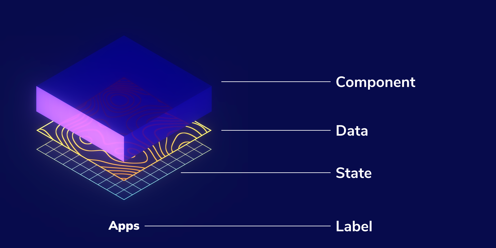

import { Scroller } from '@components/scroller';
import {
  Hello3D,
  TetrisBlock,
  NoiseMaterial,
  BasicAnimation,
} from './lazy-scenes';
import cddMp4 from '../../assets/cdd.mp4';
import solarstormMp4 from '../../assets/solarstorm.mp4';
import cddStorybookMp4 from '../../assets/cdd-storybook.mp4';

<SourceCard name="Solar Storm" link="https://solarstorm.netlify.app/">
  <Video autoplay loop muted playsInline display="block" mb="0">
    <source src={solarstormMp4} type="video/mp4" />
  </Video>
</SourceCard>

WebGL is the magic sauce behind [Solar Storm](https://solarstorm.netlify.app/) , an audio-reactive music video that renders live in the browser. After fumbling around with Three.js for many years, WebGL finally clicked for me thanks to [React Three Fiber](https://docs.pmnd.rs/react-three-fiber/getting-started/introduction). That’s because I could use the familiar concepts—components, props, hooks and state—and transfer my app development skills to 3D graphics.

This article shows you how to create breathtaking 3D animations using React Three Fiber (R3F). We'll walk through setting up a stage, creating geometry, adding lighting and enabling post-processing effects. What's more, you'll get to learn by recreating the animation below from scratch.

<SourceCard
  name="Visualization"
  link="https://github.com/winkerVSbecks/storybook-blocks"
>
  <Embed
    width="100%"
    height={700}
    mb={0}
    display="block"
    src="https://main--60fff54833991c0039d51492.chromatic.com/iframe.html?id=app--default&args=&viewMode=story&singleStory=true"
  />
</SourceCard>

## Declarative and Componentized WebGL

Before we begin, it’s worth covering why building with components offers more benefits than just _familiarity_.

Breaking up the UI into components makes it easier to reason through your code and build complex interfaces. The structure, styling and associated logic get encapsulated into one reusable module. You can test all its variants and work through its edge cases. The same is true for WebGL.

With Three.js, the code for creating the geometry & material, combining it into a mesh and animating is split across multiple parts of the file. R3F enables you to package all of that into a single component. That way, you can start by building basic meshes, then progressively combining them to create scenes and finally, layer on post-processing effects.

### Build it up part by part

[Storybook](http://storybook.js.org) is my go-to tool for building meshes in isolation. That allows you to finesse them without worrying about other scene elements. No constant repositioning or toggling global lighting & effects. You can focus on getting the look and feel just right.

<SourceCard
  name="Visualization Storybook"
  link="https://main--60fff54833991c0039d51492.chromatic.com/"
>
  <Box bg="#323132">
    <Video autoplay loop muted playsInline display="block" mb="0">
      <source src={cddStorybookMp4} type="video/mp4" />
    </Video>
  </Box>
</SourceCard>

To get started, you need a [minimal scene](https://github.com/winkerVSbecks/storybook-blocks/blob/main/.storybook/StoryStage.js) that’ll wrap each story using a decorator.

```js
import { StoryStage } from '../../.storybook/StoryStage';
import { TetrisBlock } from './TetrisBlock';

export default {
  title: 'Meshes/TetrisBlock',
  component: TetrisBlock,
  decorators: [(storyFn) => <StoryStage>{storyFn()}</StoryStage>],
};
```

## Your first scene

Web UIs are built using HTML & CSS. 3D scenes are similar, but the building blocks are geometry, material and lights. You start with a **Geometry** that describes the shape of an object (think HTML). You can apply a **Material** to this geometry that controls the look and feel (think CSS). Combined together, you get an **Mesh**. You can place this mesh in a 3D space. Then add in some **Lights** to be able to see your object. Finally, a **Renderer** renders the whole thing as though you were looking at it through a **Camera**.

<Hello3D />

The above is a demo of an introductory 3D scene—a rotating box. Notice how everything is a component. The canvas, lights, geometry, material and mesh. The entire Three.js API is automatically available as components in R3F.

## Decomposing & building the scene

Now that we have the basics down, let’s go back to the visualization we’re building. The high-level elements of this scene are:

- **Components:** these have Tetris block shapes with translucent material.
- **Data & State:** these are flat planes with funky custom textures.
- **Label:** this is just a text overlay.



### Components (Tetris blocks)

The _components_ in this visualization are represented by Tetris blocks. These shapes are constructed by drawing a 2D path and then extruding it along the Z-axis. We’ll use the [Extrude](https://github.com/pmndrs/drei/#shapes) utility from Drei, which offers a shortcut syntax to create such shapes.

<CallOut>
  <a href="https://docs.pmnd.rs/drei/introduction">Drei</a> is a helper library
  that offers utilities for common Three.js tasks, e.g., adding audio or Orbit
  controls or creating a custom shader material.
</CallOut>

<TetrisBlock />

The syntax for defining the shape is quite similar to [SVG Paths](https://developer.mozilla.org/en-US/docs/Web/SVG/Tutorial/Paths). You can control the extrude depth and bevelled edges using the `extrudeSettings`.

That’s that for the geometry, but remember, a mesh consists of a geometry plus a material. We'll use [MeshPhysicalMaterial](https://threejs.org/docs/?q=meshPhysicalMaterial#api/en/materials/MeshPhysicalMaterial) here. It allows you to replicate physical properties such as transparency, roughness and clearcoat. In this case, we've used it for a [Glassmorphism](https://uxdesign.cc/glassmorphism-in-user-interfaces-1f39bb1308c9) effect, which is a super popular aesthetic right now.

### Data & State

Now that we know how to create meshes let's focus on making custom materials. At its core, a material is a shader, and a shader is a program that takes a set of inputs and produces a texture. For Data and State, we'll build custom shader materials using the [shaderMaterial](https://github.com/pmndrs/drei/#shadermaterial) utility from Drei.

<NoiseMaterial />

`shaderMaterial` takes in a set of uniforms plus the vertex and fragment shaders, and returns a material. We then use `extend` to add it to the R3F namespace and finally apply it to the [Plane](https://github.com/pmndrs/drei/#shapes).

<CallOut>
  Not sure how to get started with shaders? Check out the{' '}
  <a href="https://market.pmnd.rs/materials">Poimandres marketplace</a> for a
  bunch of ready-to-use materials.
</CallOut>

The shader in this example is using [noise](https://varun.ca/noise/#noise-material) and is animated using the `time` uniform. You can use the `useFrame` hook to access the Three.js clock and update the time value.

### Label

Rendering text in WebGL is [_complicated_](https://threejs.org/docs/index.html?q=text#manual/en/introduction/Creating-text). That complexity only ramps up if you want to use a custom font. That’s why if possible, use HTML and layer the text on top of your scene. That's exactly what we're doing here. The Label is absolutely positioned on top of the canvas.

```js
import React from 'react';
import styled from 'styled-components';

const Container = styled.div`
  pointer-events: none;
  position: fixed;
  left: 0;
  right: 0;
  bottom: 0;
  width: 100%;
  height: 144px;
`;

const Box = styled.div`...`;
const Text = styled.div`...`;

export const Label = () => {
  return (
    <Container>
      <Box>
        <Text>Atomic components</Text>
      </Box>
    </Container>
  );
};
```

For more complex applications, I recommend the [Html](https://github.com/pmndrs/drei/#html) component, which controls size and positioning of your HTML content based on its location in the 3D space.

### Compose the scene and animate!

We have all the bits now; the next step is to animate them using [React Spring](https://docs.pmnd.rs/react-spring/introduction). It uses a spring-physics-based model where the animated props are generated using the `useSpring` hook and applied to an `animated` component instance.

<BasicAnimation />

The visualization has four states and the position, scale and colour of the meshes animate between each step. We can track all that info in an array and use component state for cycling between each step.

```js
import React from 'react';

const STEP_COUNT = 4;

export function useCDDState() {
  const [step, setStep] = React.useState(0);

  React.useEffect(() => {
    const t = setInterval(
      () => setStep((state) => (state + 1) % STEP_COUNT),
      3000
    );
    return () => clearTimeout(t);
  }, []);

  return step;
}

// Then in the component:
//
// const step = useCDDState();
// const spring = useSpring(STATES[step]);
```

The embed below is interactive. Zoom out and rotate the scene to see how the animation is executed. Or check out the [source](https://github.com/winkerVSbecks/storybook-blocks/blob/main/src/cdd-scene/ComponentDriven.js) to see how each mesh is wired up to a spring.

<SourceCard
  name="storybook-blocks/src/cdd-scene/ComponentDriven.js"
  link="https://github.com/winkerVSbecks/storybook-blocks/blob/main/src/cdd-scene/ComponentDriven.js"
>
  <Embed
    width="100%"
    height="600"
    mb={0}
    display="block"
    src="https://60fff54833991c0039d51492-nqnxmkzxja.chromatic.com/?path=/story/cdd-scene-componentdriven--default&full=1&shortcuts=false&singleStory=true"
  />
</SourceCard>

React Spring works with both Three.js objects and HTML, so we can also apply the same principles to animate the label. All animations are driven by the same state and therefore stay in sync.

<SourceCard
  name="storybook-blocks/src/cdd-scene/Label.js"
  link="https://github.com/winkerVSbecks/storybook-blocks/blob/main/src/cdd-scene/Label.js"
>
  <Embed
    width="100%"
    height="200"
    mb={0}
    display="block"
    src="https://60fff54833991c0039d51492-nqnxmkzxja.chromatic.com/iframe.html?id=cdd-scene-label--default&args=&viewMode=story&singleStory=true"
  />
</SourceCard>

### Post processing effects

Lastly, we're going to add a glow effect to the scene. Post-processing effects are also shaders but applied to the entire rendered output instead of individual meshes.

This whole process is often referred to as a render pipeline. You start by rendering the scene as usual and pass that as the input into the first effect shader. Then give that output to the following effect and so on. The output of the final effect is rendered onto the screen.

```js
import * as THREE from 'three';
import React, { useMemo } from 'react';
import { Effects as EffectsComposer } from '@react-three/drei';
import { extend, useThree } from '@react-three/fiber';
import { UnrealBloomPass } from 'three-stdlib';

extend({ UnrealBloomPass });

export const Effects = () => {
  const { size, scene, camera } = useThree();
  const aspect = useMemo(
    () => new THREE.Vector2(size.width, size.height),
    [size]
  );

  return (
    <EffectsComposer
      multisamping={8}
      renderIndex={1}
      disableGamma
      disableRenderPass
    >
      <renderPass attachArray="passes" scene={scene} camera={camera} />
      <unrealBloomPass attachArray="passes" args={[aspect, 0.4, 1, 0]} />
    </EffectsComposer>
  );
};
```

In our case, we have just one effect, the `unrealBloomPass`, which adds that nice sci-fi glow.

<SourceCard
  name="storybook-blocks/src/cdd-scene/Effects.js"
  link="https://github.com/winkerVSbecks/storybook-blocks/blob/main/src/cdd-scene/Effects.js"
>
  <Embed
    width="100%"
    height="500"
    mb={0}
    display="block"
    src="https://60fff54833991c0039d51492-nqnxmkzxja.chromatic.com/iframe.html?id=cdd-scene-effects--default&args=&viewMode=story&singleStory=true"
  />
</SourceCard>

## Wrapping up

Success! We used React Three Fiber to create an animated 3D visualization. The whole thing is simply a component that you can drop into any React app, and it'll work.

Solarstorm was built mainly using these techniques. The significant difference was that instead of animating with springs, I used JavaScript to analyze the audio and use that output to drive the animations. Now that you're familiar with these concepts, jump into [the source code](https://github.com/winkerVSbecks/solarstorm/) or use that as a starting point for your own audio reactive scene.
