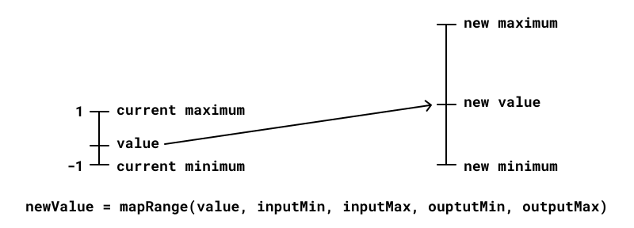
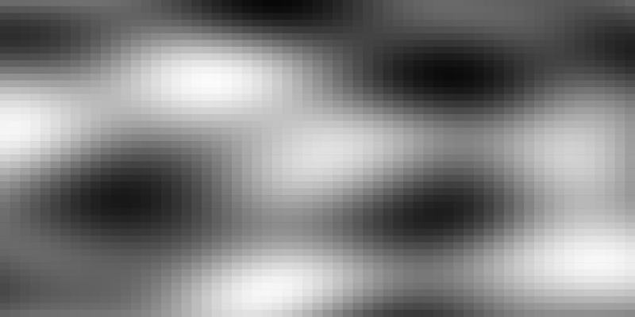
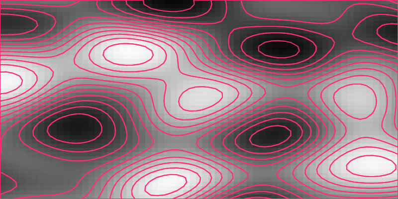

import {
  NoiseVsRandom,
  NoiseWave,
  Noise1D,
  Noise2D,
  Noise3D,
  Noise4D,
} from './lazy-scenes';

import chromaticNoiseMp4 from '../../assets/chromatic-noise.mp4';
import animatedContoursMp4 from '../../assets/animated-contours.mp4';
import plasmaMp4 from '../../assets/plasma.mp4';
import vectorFieldMp4 from '../../assets/vector-field.mp4';
import flowFieldPlotterMp4 from '../../assets/flow-field-plotter.mp4';
import particleMovementMp4 from '../../assets/particle-movement.mp4';
import particlePathMp4 from '../../assets/particle-path.mp4';
import flowFieldMp4 from '../../assets/flow-field.mp4';
import marsMp4 from '../../assets/mars.mp4';
import ghostPlanetsMp4 from '../../assets/ghost-planets.mp4';

<Video autoplay loop muted playsInline display="block">
  <source src={chromaticNoiseMp4} type="video/mp4" />
</Video>

Noise is an indispensable tool for creative coding. We use it to generate all kinds of organic effects like clouds, landscapes and contours. Or to move and distort objects with a more lifelike behaviour.

On the surface, noise appears to be simple to use but, there are so many layers to it. This post takes a deep dive into what noise is, its variants, how to use it on the web and its applications. And lot's of examples. So many examples!

## What is noise?

Imagine you want to move an object around the screen. Animators will use keyframes and tweens to describe the exact motion. Generative artists instead rely on algorithms.

So what, something like `math.random()`?

Not exactly. Randomness is just too unnatural. Look at that pink ball, bouncing all over the place. It's nauseating 🥴

What we need is a smoother, more *organic randomness*. That is what the noise function generates (the yellow ball). Much more aesthetically pleasing!

<NoiseVsRandom />

This idea of *organic randomness* appears again and again in creative coding. For example, when generating textures, moving objects or distorting them. We often reach for the noise function.

### Generating noise on the web

There are two flavours of noise—Perlin and Simplex.

Ken Perlin developed the first while working on Tron in the early 1980s and won an [Oscar](https://mrl.cs.nyu.edu/~perlin/doc/oscar.html) 🏆 for those special effects. He then improved on it with Simplex noise and made it a bit faster. I'll focus on the later and use the [simplex-noise](https://www.npmjs.com/package/simplex-noise) library for my examples.

The noise function takes in a couple of inputs (which _drive_ the output) and returns a value between -1 and 1. The output is a mix of `Math.sin()` and `Math.random()`. A random wave is how I would describe it.

```js
import SimplexNoise from 'simplex-noise';

const simplex = new SimplexNoise();
const y = simplex.noise2D(x * frequency, 0) * amplitude;
```

The underlying mechanics are similar to how waves work so, you can control how quickly or how much it oscillates by adjusting frequency and amplitude.

<NoiseWave />

Umm, noise… 2D, what's happening here?

## Noise Dimensions

The noise algorithm can be implemented for multiple dimensions. Think of these as the number of inputs into the noise generator. Two for 2D, three for 3D and so on.

Which dimension you pick depends on what variables you want to drive the generator with. Let's look at a few examples.

### Noise 1D — Wave Motion

Techincally there is no noise1D. But, you can get 1D noise by passing in zero as the second argument to `simplex.noise2D`. Let's say you want to move a ball with an organic looking osciallating motion. Increment its `x` coordinate and use it to generate the `y` value.

```js
x += 0.1;
y = simplex.noise2D(x * frequency, 0) * amplitude;
```

<Noise1D />

### Noise2D — Terrain Generator

We can turn a flat 2D plane into hilly terrain by moving its vertices in the z-direction. Use the `x` and `y` coordinates to generate the `z` location.

And just like that, we have a terrain generator 🏔️

```js
z = simplex.noise2D(x * frequency, y * frequency) * amplitude;
```

<Noise2D />

### Noise3D — Vertex Displacement

You've probably seen these [distorted spheres](https://tympanus.net/codrops/2021/01/26/twisted-colorful-spheres-with-three-js/) in the wild. They are created by displacing the vertices of a sphere. Use the vertex coordinate `(x, y, z)` to generate the distortion amount. Then displace the vertex by it radially.

```js
const distortion =
  simplex.noise3D(x * frequency, y * frequency, z * frequency) * amplitude;

newPosition = position.normalize().multiplyScalar(distortion);
```

<Noise3D />

### Noise4D — Animated Distortion

We can animate the distorted sphere by using 4D noise. The inputs will be the vertex coordinate `(x, y, z)` and `time`. This technique is used to create [fireballs](https://www.clicktorelease.com/blog/vertex-displacement-noise-3d-webgl-glsl-three-js/), amongst other things.

```js
const distortion =
  simplex.noise4D(
    x * frequency,
    y * frequency,
    z * frequency,
    time * frequency
  ) * amplitude;

newPosition = position.normalize().multiplyScalar(distortion);
```

<Noise4D />

Notice our use of amplitude in the above examples. It's a handy way to scale the noise output to your application. You could also use [interpolation](https://github.com/mattdesl/canvas-sketch-util/blob/master/docs/math.md#mapRange) to map the noise output to a specified range of your choice.



Now that we have the basics down, let's look at a few more applications of noise.

## Textures

The noise output for a 2D grid, with `(x,y)` coordinates, looks something like this:



This is going to be our starting point.

We can use the [Marching Squares algorithm](https://thecodingtrain.com/challenges/coding-in-the-cabana/005-marching-squares.html) to turn that 2D noise data into contours. For more on this, checkout on my post on [creating a generative image service](https://storybook.js.org/blog/generative-image-service/).



The cool thing about noise is that you can go up one dimension, layer in time and animate your image.

<SourceCard
  name="basic-noise.js"
  link="https://github.com/winkerVSbecks/sketchbook/blob/master/basic-noise.js"
>
  <Video autoplay loop muted playsInline mb="0">
    <source src={animatedContoursMp4} type="video/mp4" />
  </Video>
</SourceCard>

## Fields

Honestly, this 2D grid of noise data is super utilitarian. It's my go-to for all kinds of stuff. Noise fields are a particular favourite of mine.

Let's go back to that initial grayscale output. Map that to a more interesting colour scale and you get plasma 🤩

<SourceCard
  name="plasma.js"
  link="https://github.com/winkerVSbecks/sketchbook/blob/master/plasma.js"
>
  <Video autoplay loop muted playsInline display="block" mb="0">
    <source src={plasmaMp4} type="video/mp4" />
  </Video>
</SourceCard>

Or, start with a grid of rectangles. Then turn it into a vector field by using noise to control the colour and angle of rotation.

<SourceCard
  name="vector-field.js"
  link="https://github.com/winkerVSbecks/sketchbook/blob/master/colour-field.js"
>
  <Video autoplay loop muted playsInline display="block" mb="0">
    <source src={vectorFieldMp4} type="video/mp4" />
  </Video>
</SourceCard>

## Noisy Particels

Vector fields are cool, but in my opinion, [flow fields](https://www.pinterest.ca/search/pins/?q=noise%20field) are a much more interesting visualization. Here's a plot I made last year.

<SourceCard
  name="flow-field.js"
  link="https://github.com/winkerVSbecks/penplot-sketches/blob/master/sketches/flow-field.js"
>
  <Video autoplay loop muted playsInline display="block" mb="0">
    <source src={flowFieldPlotterMp4} type="video/mp4" />
  </Video>
</SourceCard>

Notice the path that the pen traces. Each one of those strokes is generated by dropping a particle onto the vector field. And then tracing its path. 💫

Alright, let's break down this process.

### Creating a Flow Field

Step 1, create a vector field. Same as before. But this time, we’re not going to animate the vector field.

Step 2, drop a bunch of particles onto the canvas. Their direction of movement is based on the underlying vector field. Take a step forward, get the new direction and repeat.

<Video autoplay loop muted playsInline display="block">
  <source src={particleMovementMp4} type="video/mp4" />
</Video>

```js
function moveParticle(particle) {
  // Calculate direction from noise
  const angle =
    simplex.noise2D(particle.x * FREQUENCY, particle.y * FREQUENCY) * AMPLITUDE;

  // Update the velocity of the particle
  // based on the direction
  particle.vx += Math.cos(angle) * STEP;
  particle.vy += Math.sin(angle) * STEP;

  // Move the particle
  particle.x += particle.vx;
  particle.y += particle.vy;

  // Use damping to slow down the particle (think friction)
  particle.vx *= DAMPING;
  particle.vy *= DAMPING;

  particle.line.push([particle.x, particle.y]);
}
```

Step 3, track the location of the particle to trace its path.

<Video autoplay loop muted playsInline display="block">
  <source src={particlePathMp4} type="video/mp4" />
</Video>

Add in more particles and colour, and we get our flow field.

<SourceCard
  name="flow-field.js"
  link="https://github.com/winkerVSbecks/penplot-sketches/blob/master/sketches/flow-field.js"
>
  <Video autoplay loop muted playsInline display="block" mb="0">
    <source src={flowFieldMp4} type="video/mp4" />
  </Video>
</SourceCard>

### Particle systems

Speaking of particles, noise shows up in particle systems too. For effects like rain, snow or confetti, you're looking to simulate a natural-looking motion. Imagine a confetti particle floating down to earth. The particles don't move in straight lines. They float and wiggle due to air resistance. Noise is a really great tool for adding in that organic variability.

```js
const tiltOffset =
  (simplex.noise2D(particle.x / particle.random, particle.y / particle.random) *
    Math.PI) /
  16;
particle.tiltAngle = particle.tiltAngle + tiltOffset;
```

For a deeper dive, check my post on [building a confetti cannon](/confetti) 🎉

<SourceCard
  name="carnival-nights"
  link="https://github.com/winkerVSbecks/carnival-nights"
  bg="#000"
>
  
</SourceCard>

## Shaders

Let's circle all the way back to those animated blobs. Manipulating and animating 3D geometries is a lot more efficient with shaders. But shaders are a whole different world unto themselves. For starters, there is a special WebGL version of noise, [glsl-noise](https://www.npmjs.com/package/glsl-noise). We'll need to import that into our shader using [glslify](https://github.com/glslify/glslify).

We'll take it slow, starting with 2D first.

<SourceCard
  name="mars.js"
  link="https://github.com/winkerVSbecks/sketchbook/blob/master/mars.js"
>
  <Box bg="#323132">
    <Video
      autoplay
      loop
      muted
      playsInline
      display="block"
      width="50%"
      mx="auto"
      mb="0"
    >
      <source src={marsMp4} type="video/mp4" />
    </Video>
  </Box>
</SourceCard>

The animation above is quite similar to the contours we looked at earlier. It's implemented as a fragment shader. Which means we run the same program for each pixel of the canvas.

Notice the `pragma` line? That's us importing webgl-noise. Then use it to generate noise data for each pixel position `vUv`.

This part should look quite familiar.

```glsl{16-19}:title=fragment.glsl
precision highp float;
uniform float time;
uniform float density;
varying vec2 vUv;

#define PI 3.141592653589793
#pragma glslify: noise = require(glsl-noise/simplex/3d);

float patternZebra(float v){
  float d = 1.0 / density;
  float s = -cos(v / d * PI * 2.);
  return smoothstep(.0, .1 * d, .1 * s / fwidth(s));
}

void main() {
  // Generate noise data
  float amplitude = 1.0;
  float frequency = 1.5;
  float noiseValue = noise(vec3(vUv * frequency, time)) * amplitude;
  // Convert noise data to rings
  float t = patternZebra(noiseValue);
  vec3 color = mix(vec3(1.,0.4,0.369), vec3(0.824,0.318,0.369), t);
  // Clip the rings to a circle
  float dist = length(vUv - vec2(0.5, 0.5));
  float alpha = smoothstep(0.250, 0.2482, dist);

  gl_FragColor = vec4(color, alpha);
}
```

Fragment shaders have this concept of [distance functions](https://thebookofshaders.com/07/), used for drawing shapes. `patternZebra` is one such example that converts noise data into rings. Essentially it returns either `0` or `1`. Which we then use to pick a colour using `mix`. And finally, use another distance function to clip a circular boundary.

Seems quite basic?

Well, the cool thing about fragment shaders is that you can turn it into a material and apply it to a more complex geometry. Like the example below 👻

<SourceCard
  name="ghost-planets.js"
  link="https://github.com/winkerVSbecks/3d-sketches/blob/master/sketches/ghost-planets.js"
>
  <Box bg="#110488">
    <Video
      autoplay
      loop
      muted
      playsInline
      display="block"
      width="50%"
      mx="auto"
      mb="0"
    >
      <source src={ghostPlanetsMp4} type="video/mp4" />
    </Video>
  </Box>
</SourceCard>

Vertex displacement is quite similar. Instead of a fragment shader, we write a vertex shader that transforms each vertex of the sphere. Again, applied using a [shader material](https://threejs.org/docs/?q=shade#api/en/materials/ShaderMaterial).

```glsl{11-14}:title=vertex.glsl
precision highp float;
varying vec3 vNormal;

#pragma glslify: snoise4 = require(glsl-noise/simplex/4d)

uniform float u_time;
uniform float u_amplitude;
uniform float u_frequency;

void main () {
  vNormal = normalMatrix * normalize(normal);

  float distortion = snoise4(vec4(normal * u_frequency, u_time)) * u_amplitude;
  vec3 newPosition = position + (normal * distortion);

  gl_Position = projectionMatrix * modelViewMatrix * vec4(newPosition, 1.0);
}
```

## Conclusion
