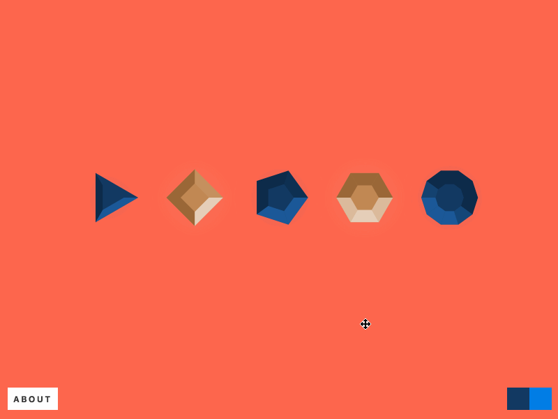

import PolarCoords from './diagrams';

## Cartesian Coordinate System

A coordinate system allows us to use numbers to determine the position of points in a 2D or 3D space. The most popular coordinate system is probably the Cartesian coordinate system. It allows you to locate each point by a pair of numerical coordinates `(x, y)`. There is a very good chance that you have used this system. It is everywhere — SVG, Canvas, WebGL and even Sketch & Illustrator.

<figure mx="auto">
  <PolarCoords.CartsCoords />

  <figcaption fontFamily="code">
    <b>Figure 1:</b> Cartesian coordinate system
  </figcaption>
</figure>

## Polar Coordinate System

Polar coordinate system is a 2D coordinate system in which each point is determined by `r` & `θ`. Where `r` is the distance from the origin and `θ` is the angle from the x-axis.

<figure mx="auto">
  <PolarCoords.PolarCoords />

  <figcaption fontFamily="code">
    <b>Figure 2:</b> Polar coordinate system
  </figcaption>
</figure>

### Converting Between Polar and Cartesian Coordinates

Trigonometry! Love it or hate, it is everywhere. You can convert a point from polar coordinates `(r, θ)` to Cartesian coordinates `(x, y)` using the equations below. These come in really handy since most tools only accept `x` & `y` as point locations.

```js
const x = r * Math.cos(theta);
const y = r * Math.sin(theta);
```

## Patterns

Below I have a few animations by [Dave Whyte](https://dribbble.com/beesandbombs) aka bees & bombs. They all have one thing in common, they use polar coordinates to generate a pattern.

<Flex as="figure" flexWrap="wrap" justifyContent="space-evenly" mx={0} my={5}>
  <PolarCoords.PatternExamples />

  <figcaption fontFamily="code" width="100%">
    <b>Figure 3:</b> Patterns generated using polar coordinates
  </figcaption>
</Flex>

Cartesian coordinates are a great choice for placing things evenly on a rectangular grid. However, if you want to distribute things evenly around a circle then polar coordinates are generally the better option. Keeping the radius constant we compute the angle for each point as `angle = 360° * index / number of sides`.

<figure>
  <PolarCoords.PolarPatterns />

  <figcaption fontFamily="code">
    <b>Figure 4:</b> Placing items evenly around a circle
  </figcaption>
</figure>

Below is the JavaScript implementation of this idea. The `points` function also accepts an optional `offset` argument to shift the points along the perimeter of the circle. For example, the outermost circle of points in **Figure 4** can be generated using `points(12, 200)`. The next one inwards using `points(12, 175, 15)`. The one after that using `points(12, 150, 30)` and so on. My [splash](https://codepen.io/winkerVSbecks/pen/oLmqQo) CodePen is was built using this.

```js
function points(count, radius, offset = 0) {
  const angle = 360 / count;
  const vertexIndices = range(count);

  return vertexIndices.map(index => {
    return {
      theta: offset + degreesToRadians(offset + angle * index),
      r: radius,
    };
  });
}

// number => [0, 1, 2, ... number]
function range(count) {
  return Array.from(Array(count).keys());
}

function degreesToRadians(angleInDegrees) {
  return (Math.PI * angleInDegrees) / 180;
}
```

## Polygon Generator

A regular polygon is a polygon that is equiangular i.e., all its angles are equal and all its sides have the same length. This means that all the vertices of a regular polygon are points evenly spaced on a circle. And isn't it handy that we just created a function that generates exactly this!

<figure>
  <PolarCoords.PolarPolygon />

  <figcaption fontFamily="code">
    <b>Figure 5:</b> Drawing a polygon by connecting polar coordinates
  </figcaption>
</figure>

To generate an SVG polygon we will generate the list of of points using the `points` function and then simply connect the dots. With SVG we have two options for this: `<polygon>` or `<path>`. The example below generates the _points_ attribute for a `<polygon>` element.

```js
/**
 * Usage with Vanilla JS/DOM:
 *   polygonEl.setAttribute('points', polygon((5, 64, 18)));
 *
 * Usage with React:
 *   <polygon points={polygon((5, 64, 18)} />
 *
 * Usage with View:
 *   <polygon :points="polygon((5, 64, 18)" />
 */
function polygon(noOfSides, circumradius, rotation) {
  return points(noOfSides, circumradius, rotation)
    .map(toCartesian)
    .join(' ');
}

function toCartesian({ r, theta }) {
  return [r * Math.cos(theta), r * Math.sin(theta)];
}
```

Seems simple but, you can do a lot of interesting things with it. Here are a couple of examples:

<figure>
  
  <figcaption>
    <a href="http://winkervsbecks.github.io/gems/">
      Gems generated using polar coordinates
    </a>
  </figcaption>
</figure>

<CodePen
  hash="PmNJpJ"
  title="Hex-a-portal (Dynamic + RGB)"
  height="600"
  defaultTab="result"
/>

## Relative Polar Coordinates

When you define a point as `(r, θ)`, by default, this is relative to the origin `(0, 0)`. We can define points relative to other points by shifting the origin. This is often used for defining the position of curve handles relative to a vertex.

```js
const x = cx + r * Math.cos(theta);
const y = cy + r * Math.sin(theta);
```

<figure>
  <PolarCoords.RelativePolarCoords />

  <figcaption fontFamily="code">
    <b>Figure 6:</b> Relative polar coordinates
  </figcaption>
</figure>

We can modify the polygon generator to allow us to draw a polygon centred at any location in the SVG canvas.

```js
function polygon(noOfSides, circumradius, rotation, [cx = 0, cy = 0]) {
  return points(noOfSides, circumradius, rotation)
    .map(pt => toCartesian(pt, [cx, cy]))
    .join(' ');
}

function toCartesian({ r, theta }, [cx, cy]) {
  return [cx + r * Math.cos(theta), cy + r * Math.sin(theta)];
}
```

<CodePen
  hash="wrZQQm"
  title="SVG Polygon Generator"
  height="700"
  defaultTab="result"
/>

## Rotation

Another common application of polar coordinates is to rotate things around a point. Here `(cx, cy)` is the point about which you want to rotate.

```js
x = cx + r * Math.cos(theta);
y = cy + r * Math.sin(theta);

// somewhere in an animation loop
window.setInterval(() => {
  theta++;
}, 1000 / 60);
```

<CodePen
  hash="aOEeXB"
  title="Rocket around the moon"
  height="500"
  defaultTab="result"
/>

## Polar curves

We started by looking at individual points. Then we grouped a few points into a [set](<https://en.wikipedia.org/wiki/Set_(mathematics)>) to define shapes. For this we used the polygon generator function to compute the location of each vertex of the shape. We can write similar functions using other mathematical equations. Allowing us to generate more complex shapes and curves.

Two dimensional curves are described by equations of the type `y = f(x)`. For example the equation of a circle is <code>x<sup>2</sup> + y<sup>2</sup> = r<sup>2</sup></code>. We can generate the set of points, called [locus](<https://en.wikipedia.org/wiki/Locus_(mathematics)>), by iterating `x` and computing the corresponding `y` value or vice-versa. Therefore, each point will be of the form `(x, f(x))` or `(g(y), y)`.

With polar coordinates we can similarly draw polar curves. For example, the polar equation of a circle is `r = 2 * cos(0)`. The points on a polar curve have the form `(r(0), 0)`.

```js
// examples of fn:
//   circle     : 2 * Math.cos(theta)
//   blob thing : a * (1 - Math.cos(theta) * Math.sin(3 * theta))
const r = fn(theta);

const x = cx + r * Math.cos(theta);
const y = cy + r * Math.sin(theta);
```

<CodePen hash="pdVLPo" title="Cardioid" height="600" defaultTab="js,result" />

## Eukleides

All the diagrams in this post were created using a language called [eukleides](http://www.eukleides.org). It is a fantastic tool for making geometric drawings. Just look at this declarative API 😍

```
c = circle(point(3, 0), 3)
P = point(c, 170°)
M = point(0, 0)
N = point(6, 0)

draw (M.N.P)
label M, P, N right, 0.6
```
