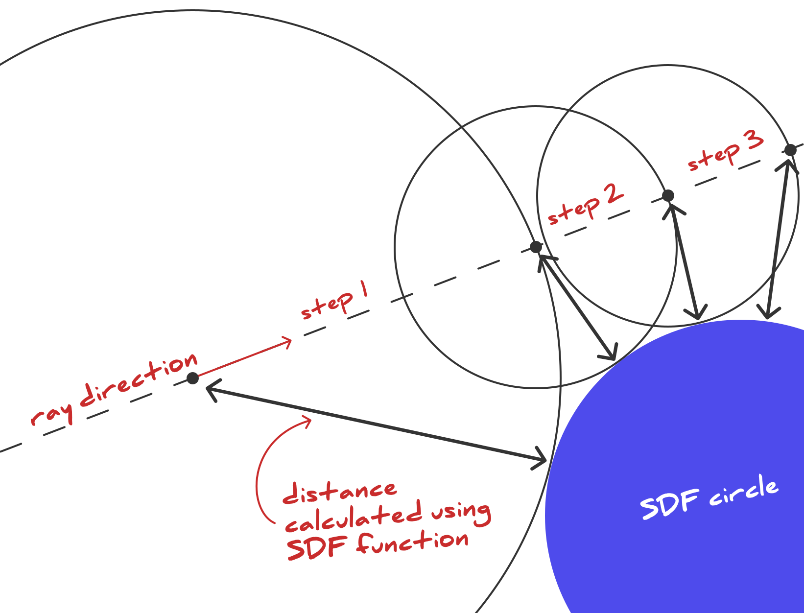

import { Scroller } from '@components/scroller';
import { SdfCrystal } from './sketch';
import iridescentCrystal from '../../assets/iridescent-crystal.mp4';
import echeveria from '../../assets/echeveria.mp4';
import rayMarching from '../../assets/ray-march.svg';
import rayDirection from '../../assets/ray-direction.svg';
import fuckAroundFindOut from '../../assets/fuck-around-find-out.jpg';

export const figures = [
  <SdfCrystal activeIndex={0} />,
  <SdfCrystal
    activeIndex={1}
    tweak={{ name: 'lensLength', value: 2, min: 0.1, max: 4, step: 0.1 }}
  />,
  <SdfCrystal
    activeIndex={2}
    tweak={{ name: 'lensLength', value: 2, min: 0.1, max: 4, step: 0.1 }}
  />,
  <SdfCrystal activeIndex={3} />,
  <SdfCrystal activeIndex={4} />,
  <SdfCrystal
    activeIndex={5}
    tweak={{ name: 'activeLayers', value: 3, min: 0, max: 3, step: 1 }}
  />,
  <SdfCrystal
    activeIndex={6}
    tweak={{
      name: 'mixBaseAndIridescent',
      value: 0.5,
      min: 0,
      max: 1,
      step: 0.1,
    }}
  />,
  ,
];

<SourceCard
  name="sdf-iridescent-crystal.js"
  link="https://github.com/winkerVSbecks/shader-sketches/blob/main/sketches/sdf-iridescent-crystal.js"
>
  <Video autoplay loop muted playsInline display="block" mb="0">
    <source src={iridescentCrystal} type="video/mp4" />
  </Video>
</SourceCard>

When building a 3D scene using libraries such as Three.js we generally use meshes. You define a geometry attach some material to it to create a mesh. Then add that mesh to the scene to render it. This is also how 3D modelling software like Blender and Cinema4D work. However, in the demoscene world—where the goal of is to create stuff using extremely small and self-contained computer programs—this approach didn't work. They'd have to package a 3D library or engine along with the demo code which takes up a lot of memory. So, those folks came up with a pretty innovative approach. They used signed distance fields (SDFs) to define the geometry and then use raymarching to render the scene. The whole thing runs in a single shader program.

If you've ever come across demos on [Shadertoy](https://www.shadertoy.com/) or [GLSL Sandbox](http://glslsandbox.com/), you've seen this approach in action. While the initial goal was a small file size, it also allows you to create some [really cool effects](https://www.shadertoy.com/user/tdhooper/sort=popular&from=0&num=8) and use boolean operations to create complex shapes. In this article, I'll show you how to create an iridescent crystal using raymarching and SDFs.

<CallOut>
  ℹ️ This post assumes foundational knowledge of shaders. If you're not familiar
  with shaders or the GLSL API, check out:{' '}
  <a href="https://typefully.com/DanHollick/gpnhhud">
    Dan Hollick's twitter thread
  </a>{' '}
  for a brief overview,{' '}
  <a href="https://youtu.be/f4s1h2YETNY">kishimisu's intro tutorial</a> that
  breaks down basic GLSL concepts, and{' '}
  <a href="https://blog.maximeheckel.com/posts/the-study-of-shaders-with-react-three-fiber/">
    Maxime Heckel's tutorial
  </a>{' '}
  on shaders with React Three Fiber .
</CallOut>

## Ray Marching

We select a position for the camera, then send rays from the camera to each pixel in the output image. We step along each ray, bit by bit, checking to see if we hit an object in the scene. If we did, we're done! If not, keep going up to some maximum number of steps along the ray.

<figure>
  
  <figcaption>
    <a href="https://en.wikipedia.org/wiki/Ray_tracing_(graphics)">
      from "Ray tracing" on Wikipedia
    </a>
  </figcaption>
</figure>

If you've done any kind of 3D work, you're probably familiar with the idea of defining geometry using vertices. For example, a cube is defined by 8 vertices. But with raymarching, we use a signed distance field to represent the entire scene.

<CallOut>
  🤔 <b>Raytracing vs Raymarching</b>
  <br />
  Raytracing is a very similar process to raymarching, the key difference is
  that geometry is typically defined as triangles, spheres, etc. To find the
  intersection between the view ray and the scene, we conduct a series of
  geometric intersection tests. For example, does the ray intersect with a
  triangle and, if so, which part of the triangle.
</CallOut>

### Signed Distance Field (SDF)

While the term SDF may sound daunting, it's just a function that calculates the shortest distance from any point in space to a shape's surface. The distance is negative for points within the shape, positive for points outside the shape, and zero for points exactly on the surface of the shape.

For example, a circle can be defined by the following function:

```glsl
float sdCircle(vec2 point, float radius) {
  return length(point) - radius;
}
```

You can find functions for various [2D](https://iquilezles.org/articles/distfunctions2d/) and [3D](https://iquilezles.org/articles/distfunctions/) SDFs on Inigo Quilez's website. Or use the [glsl-sdf-primitives](https://github.com/marklundin/glsl-sdf-primitives) library. I'll explain how to use these functions later in the article.

<p width="50%" mx="auto">
  
</p>

Back to raymarching. When stepping along the ray, the obvious option is to take a tiny step at a time and check for collisions. But since SDF provides us with the distance to the surface, we know that we can step by that distance without going through the surface. Doing so both speeds up the process and improves accuracy.

## Implementing a raymarched scene

Alright, onto the crystal. Let's take the technique I shared above and implement it in GLSL. We'll start with a basic shader scene, add raymarching to it, and then implement lighting and materials.

<Scroller
  width={400}
  figures={figures}>

### Basic shader scene

My goto tool for creative coding is [canvas-sketch](https://github.com/mattdesl/canvas-sketch). It offers a [utility function](https://github.com/mattdesl/canvas-sketch-util/blob/master/docs/shader.md#shader--createshaderopt) that creates a full-screen GLSL shader renderer using [regl](https://regl.party/). You can pass in your shader code and uniforms and it takes care of the rest. Here's an example of a shader that renders a gradient.

<SdfCrystal className="visualization" mb={4} activeIndex={0} />

```js
const canvasSketch = require('canvas-sketch');
const createShader = require('canvas-sketch-util/shader');
const glsl = require('glslify');

const settings = {
  dimensions: [1080, 1080],
  context: 'webgl',
  animate: true,
};

const frag = glsl(`
  precision highp float;

  uniform float time;
  varying vec2 vUv;

  void main () {
    vec3 col = 0.5 + 0.5 * cos(time + vUv.xyx + vec3(0,2,4));
    gl_FragColor = vec4(col, 1.0);
  }
`);

const sketch = ({ gl, canvas }) => {
  return createShader({
    gl,
    frag,
    uniforms: {
      resolution: ({ width, height }) => [width, height],
      time: ({ time }) => time,
      playhead: ({ playhead }) => playhead,
    },
  });
};

canvasSketch(sketch, settings);
```

Couple of things to note here. `createShader` bootstraps a default vertex shader (see below) that provides a varying `vUv`. This essentially maps the pixel coordinates to a value between 0 and 1. You can override this by specifying a custom vertex shader. But for most cases, this is sufficient.

```glsl:title=vert.glsl
precision highp float;
attribute vec3 position;
varying vec2 vUv;

void main () {
  gl_Position = vec4(position.xyz, 1.0);
  vUv = gl_Position.xy * 0.5 + 0.5;
}
```

I'm also using a tool called `glslify` to wrap the shader code. This enables us to import GLSL modules into our shader. We'll use it to import SDF functions and other raymarching utilities.

### The Raymarching Algorithm

<SdfCrystal
  className="visualization"
  mb={4}
  activeIndex={1}
  tweak={{ name: 'lensLength', value: 2, min: 0.1, max: 4, step: 0.1 }}
/>

Below is an implementation of the ray marching algorithm. The camera is positioned as the `rayOrigin`, and pointed towards the `rayTarget`—the center of the scene.

The `rayDirection` is a vector that points from the origin towards a a pixel on the screen, while accounting for the camera's orientation and field of view. It requires a bit of fancy math to figure out this direction. We'll be using the `glsl-camera-ray` module to run that calculation.


Once we obtain the ray direction, we proceed along it, checking for collisions. If a collision is detected, the distance to the surface is returned. Otherwise, we return `-1.0` to signify that no collision was found.

`lensLength` here determines the field of view. Try changing it to see how it affects the scene.

```glsl
precision highp float;
varying vec2 vUv;
uniform float lensLength;

#pragma glslify: camera = require('glsl-camera-ray')

float sdSphere(vec3 point, float radius) {
  return length(point) - radius;
}

const int steps = 90;
const float maxdist = 20.0;
const float precis = 0.001;

float raymarch(vec3 rayOrigin, vec3 rayDir) {
  float latest = precis * 2.0;
  float dist = 0.0;
  float res = -1.0;

  // March along the ray
  for (int i = 0; i < steps; i++) {
    // Break if we're close enough or too far away
    if (latest < precis || dist > maxdist) break;
    // Get the SDF distance
    float latest = sdSphere(rayOrigin + rayDir * dist, 1.0);
    // Increment by the latest SDF distance
    dist += latest;
  }
  // if we're still within bounds,
  // set the result to the distance
  if (dist < maxdist) {
    res = dist;
  }

  return res;
}

void main() {
  vec3 color = vec3(0.0);

  // Bootstrap a raymarching scene
  vec3 rayOrigin = vec3(3.5, 0., 3.5);
  vec3 rayTarget = vec3(0, 0, 0);
  // map from 0 to 1 to -1. to 1.
  vec2 screenPos = vUv * 2.0 - 1.;
  vec3 rayDirection = camera(rayOrigin, rayTarget, screenPos, lensLength);

  float collision = raymarch(rayOrigin, rayDirection);

  // If the ray collides, draw the surface
  if (collision > -0.5) {
    color = vec3(0.678, 0.106, 0.176);
  }

  gl_FragColor = vec4(color, 1);
}
```

### Using GLSL modules for raymarching

<SdfCrystal
  className="visualization"
  mb={4}
  activeIndex={2}
  tweak={{ name: 'lensLength', value: 2, min: 0.1, max: 4, step: 0.1 }}
/>

Implementing your own raymarching function is cool. In some cases, you even need to modify the inner workings to achieve a desired effect. However, in most instances, you can likely use the off-the-shelf module.

Below, I've updated the sketch to use the `glsl-raytrace` module. Additionally, I'm using a `glsl-sdf-primitives` module to generate a torus and `glsl-rotate` to rotate it.

The mechanics remain largely similar. The key difference is that geometry is now defined within a function called `doModel`, and raymarch returns a `vec2` containing the distance and material index. This is useful if you want to render multiple types of objects in a scene.

Check it out! We've got a spinning donut 🍩 But it looks kinda flat. Let's add some depth to the scene.

```glsl
precision highp float;
varying vec2 vUv;
uniform float lensLength;
uniform float time;

vec2 doModel(vec3 p);

#pragma glslify: camera = require('glsl-camera-ray')
#pragma glslify: raymarch = require('glsl-raytrace', map = doModel, steps = 90)
#pragma glslify: sdTorus = require('glsl-sdf-primitives/sdTorus')
#pragma glslify: rotate = require('glsl-rotate/rotate')

vec2 doModel(vec3 p) {
  // Spin the shape
  p.xy = rotate(p.xy, time);
  p.yz = rotate(p.yz, time);
  // Calculate SDF distance
  float d = sdTorus(p, vec2(0.75, 0.35));
  return vec2(d, 0.0);
}

void main() {
  vec3 color = vec3(0.0);
  // Bootstrap a raytracing scene
  vec3 rayOrigin = vec3(3.5, 0, 3.5);
  vec3 rayTarget = vec3(0, 0, 0);
  // map from 0 to 1 to -1. to 1.
  vec2 screenPos = vUv * 2.0 - 1.;
  vec3 rayDirection = camera(rayOrigin, rayTarget, screenPos, lensLength);

  vec2 collision = raymarch(rayOrigin, rayDirection);

  // If the ray collides, draw the surface
  if (collision.x > -0.5) {
    color = vec3(0.678, 0.106, 0.176);
  }

  gl_FragColor = vec4(color, 1);
}
```

### Calculating normals

<SdfCrystal className="visualization" mb={4} activeIndex={3} />

For the classic material and lighting combination, we need to calculate surface normals. That is, a vector that points away from the surface at a given point.

With SDFs, we calculate the normal by taking the gradient of the SDF function (f) at a specific point, denoted as ∇f. I don't know about you, but the last time I took a gradient was in [MEC E 537 - Aerodynamics](https://apps.ualberta.ca/catalogue/course/mec_e/537). And that was a while ago 😅

Luckily for us, we can use the `glsl-sdf-normal` module to compute the normal for us. The module uses the same `doModel` function that we defined for raymarching. If you're curious about the underlying math, check out [Jamie Wong's explanation](https://jamie-wong.com/2016/07/15/ray-marching-signed-distance-functions/#surface-normals-and-lighting).

```glsl
#pragma glslify: normal = require('glsl-sdf-normal', map = doModel)

// ...

if (collision.x > -0.5) {
  // Determine the point of collision
  vec3 pos = rayOrigin + rayDirection * collision.x;
  // Calculate the normal
  vec3 nor = normal(pos);
  // Convert the normal to a color
  color = nor * 0.5 + 0.5;
}

// ...
```

### Phong lighting

My personal philosophy is very much:


It's important to understand how things work, but I'm less focused on implementing everything from scratch and more intrigued by applying those concepts to create my own sketches and scenes. That's why I was super excited to come across [stack.gl/packages](http://stack.gl/packages).

The stackgl ecosystem is full of little GLSL modules that "do one thing, and do it well". You can glue these together to create all kinds of effects.

Interested in adding lighting to the scene? What type would you prefer? Lambert, Phong, Beckmann, or Specular? Just grab the associated module and plug it into the scene.

I chose `glsl-specular-blinn-phong`

<SdfCrystal className="visualization" mb={4} activeIndex={4} />

```glsl
#pragma glslify: blinnPhongSpec = require('glsl-specular-blinn-phong')

// ...

vec3 lightPos = vec3(1, 1, 1);
vec3 tint = vec3(0.05, 0.0, 0.97); // color of the shape

vec2 collision = raymarch(rayOrigin, rayDirection);

// If the ray collides, draw the surface
if (collision.x > -0.5) {
  // Determine the point of collision
  vec3 pos = rayOrigin + rayDirection * collision.x;
  // Calculate the normal
  vec3 nor = normal(pos);

  // Calculate light intensity
  vec3 eyeDirection = normalize(rayOrigin - pos);
  vec3 lightDirection = normalize(lightPos - pos);
  float power = blinnPhongSpec(lightDirection, eyeDirection, nor, 0.5);
  // light intensity * color of the shape
  color = power * tint;
}
```

### Iridescent material

Stackgl isn't the only place where you can find useful code. My other favourite option is Shadertoy. I'm not going to lie, most things on shadertoy were too daunting for me. I couldn't even begin to figure out what the code was doing.

That is, until I discovered that most work on shadertoy uses a combo of raymarching + SDF.

This was certainly a lightbulb moment for me. It's like suddenly this cryptic code was deciphered and I could understand what it said.

I've been obsessed with iridescence and have been bookmarking cool shaders. This was it. I could revisit them and try to understand how they work. One such shader was [Thomas Hooper's Crystals](https://www.shadertoy.com/view/llcXWM). It's way more complex than our scene but the general structure is the same. There's a function for generating the geometry, there's raymarching loop and after checking for collision is the bit where the iridescence effect is applied.

Let's add that to our scene.

<SdfCrystal className="visualization" mb={4} activeIndex={5} />

```glsl
vec3 pal( in float t, in vec3 a, in vec3 b, in vec3 c, in vec3 d ) {
  return a + b*cos( 6.28318*(c*t+d) );
}

vec3 spectrum(float n) {
  return pal( n, vec3(0.5,0.5,0.5),vec3(0.5,0.5,0.5),vec3(1.0,1.0,1.0),vec3(0.0,0.33,0.67) );
}

const float GAMMA = 2.2;

vec3 gamma(vec3 color, float g) {
  return pow(color, vec3(g));
}

vec3 linearToScreen(vec3 linearRGB) {
  return gamma(linearRGB, 1.0 / GAMMA);
}

// ...

if (collision.x > -0.5) {
  // Determine the point of collision
  vec3 pos = rayOrigin + rayDirection * collision.x;
  vec3 nor = normal(pos);

  vec3 eyeDirection = normalize(rayOrigin - pos);
  vec3 lightDirection = normalize(lightPos - pos);

  // Iridescent lighting
  vec3 reflection = reflect(rayDirection, nor);
  vec3 dome = vec3(0, 1, 0);
  // base layer
  vec3 perturb = sin(pos * 10.);
  color = spectrum(dot(nor + perturb * .05, eyeDirection) * 2.);
  // specular
  float specular = clamp(dot(reflection, lightDirection), 0., 1.);
  specular = pow((sin(specular * 20. - 3.) * .5 + .5) + .1, 32.) * specular;
  specular *= .1;
  specular += pow(clamp(dot(reflection, lightDirection), 0., 1.) + .3, 8.) * .1;
  // shadow
  float shadow = pow(clamp(dot(nor, dome) * .5 + 1.2, 0., 1.), 3.);
  color = color * shadow + specular;

  // gamma correction
  color = linearToScreen(color);
}
```

There are three layers to the iridescent material: the base layer (the funky gradients), a little bit of shadow and specular (the concentric light bands). Try toggling them on and off with the slider see their effects.

### Mix Phong and Iridescence

One last little tweak with the lighting. We can actually blend the phong and iridescence effects. Which enables you to have tinted iridescent objects. There's not a whole lot to it. Calculate the colors for the two effects and then blend them with the `mix` function.

<SdfCrystal
  className="visualization"
  mb={4}
  activeIndex={6}
  tweak={{
    name: 'mixBaseAndIridescent',
    value: 0.5,
    min: 0,
    max: 1,
    step: 0.1,
  }}
/>

```glsl
if (collision.x > -0.5) {
  // ...
  // Basic blinn phong lighting
  float power = blinnPhongSpec(lightDirection, eyeDirection, nor, 0.5);
  vec3 baseColor = power * tint;

  // Iridescent lighting
  // ...
  color = color * shadow + specular;

  // mix blinn phong lighting and iridescent lighting
  color = mix(baseColor, color, mixBaseAndIridescent);
  // gamma correction
  color = linearToScreen(color);
}
```

### Crystal geometry

We've got the look down but, what about the crystal shape?

Integer posuere sapien in fermentum laoreet. Nam lobortis in nibh sed ornare. Quisque eleifend sem ut ligula scelerisque porttitor. Proin eu nibh magna. Mauris ullamcorper eros sed mi euismod, sit amet sodales erat pharetra. Interdum et malesuada fames ac ante ipsum primis in faucibus. Proin a dolor tristique, gravida nisl quis, vulputate lorem.


</Scroller>

## Now, your turn

Checkout the [full source](https://github.com/winkerVSbecks/sketchbook/blob/master/torsions.js) on Github. And if you make something cool, I'd love to see it. You can find me on [Twitter](https://twitter.com/winkerVSbecks) and [Instagram](https://www.instagram.com/winkervsbecks/).

### Reference

- https://jasmcole.com/2019/10/03/signed-distance-fields/
- https://www.shadertoy.com/view/ldfSWs
