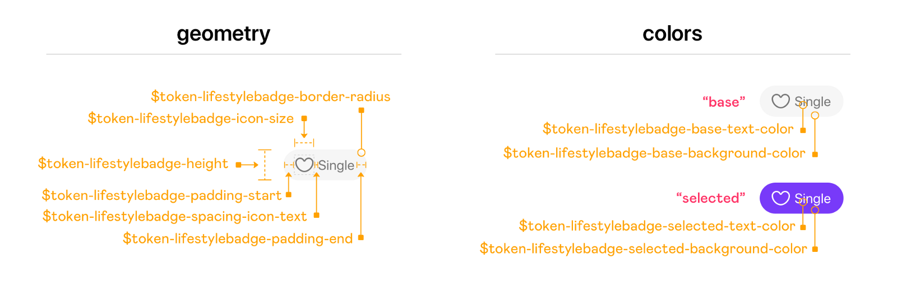

As you go from a smaller to a medium-sized team, the need to share knowledge becomes crucial. It is the perfect time to invest in a design system. However, you are also likely under delivery pressure. You are hoping to meet deadlines and roll out new features to ensure that your product is successful. In this blog post, I will share a few practices that will allow you to establish a design system that facilitates knowledge sharing without sacrificing delivery speed.

## Small Team

Small teams tend to be highly aligned. They work together on a day-to-day basis. They have a clear sense of the product’s surface area. Everyone is aware of the architecture, what components are available, where to find them, and how to use them. Because the team works so closely, knowledge sharing happens organically.

## Mid-sized Team

As the team grows, it becomes challenging to maintain a shared context. Domains begin to develop within the product and the codebase. Not everyone is aware of all the UI components or architectural decisions or even who made them. It leads to sub-teams branching off and deviating from brand standards or the established interaction model. The code complexity ramps up, and ultimately it introduces too much entropy into your development process.

## Organically Introducing a Design System

Design systems are an excellent tool to scale shared understanding and control those deviations from occurring. The challenge is that you likely don’t have the time and resources to stop and build out a design system.

The chances are that you are using a JavaScript UI framework such as React, Angular or Vue to build your product. These frameworks predominantly use a component-based architecture, which means that you already design and build UI as isolated extensible slices. That is one major step towards having your design system. There are a few more steps you can take, which leverages this component-based approach to creating a design system organically:

1. Storybook driven development
2. Implement Design Tokens
3. Start formalizing this knowledge with light-weight documentation

### Storybook Driven Development

Storybook is a tool for developing self-contained components and document use cases as stories. Stories are a combination of visual, interaction and structural testing. It supports most JS frameworks and integrates well with existing codebases.

By enabling Storybook, your team gets a quick way to surface all the components within their codebase. Storybook becomes the place where they go to find components and figure out how to use them. It also makes it easier for them to see the impact of their changes. You can also integrate it into your automated QA pipeline.

### Design Tokens

Design tokens capture low-level visual characteristics of your product. As projects scale, you find that teams start hard-coding values directly into CSS — hex codes or pixel values. By using design tokens, you can move those values up into a centralized theme. Making it easier to maintain a scalable and consistent visual system.

Most teams have a theming infrastructure already set up, using Sass or CSS custom properties or CSS-in-JS solutions. Design tokens leverage that theming support to connect low-level design decisions to components. Colours, typography and spacing are must-haves for design tokens. You can extend them to all kinds of visual attributes such as widths, heights, border styles, elevations and even structural and motion attributes.

<figure px="4">
  
  <figcaption>
    Read more about
    <a href="https://badootech.badoo.com/design-tokens-beyond-colors-typography-and-spacing-ad7c98f4f228">
      Design Tokens beyond colors, typography, and spacing.
    </a>
  </figcaption>
</figure>

### Light-Weight Documentation

The most significant impact of a design system is that it allows your team to focus on solving differentiating challenges instead of continually reinventing the wheel. To be able to figure out what problems you have solved already, you need to start documenting those challenges and solutions.

Design systems you see in the wild tend to have polished websites with thorough documentation. That can feel quite intimidating. It would be best if you recognized that that is the end state after many months and years of iteration. Light-weight tools make it easy for you to start documenting this information. Tools such as InVision DSM and Zero Height provide a highly approachable authoring experience. They support version control and allow you to plug in Storybook for live code examples. In effect, seeding your DesignOps practice and slowly implementing a governance model.

<Box
  position="relative"
  paddingBottom="50.19%"
  height="0"
  overflow="hidden"
  maxWidth="100%"
  mb={4}
>
  <Embed
    position="absolute"
    top="0"
    left="0"
    width="100%"
    height="100%"
    src="https://www.youtube.com/embed/gu9aaA8X8Qk"
    frameborder="0"
    allow="accelerometer; autoplay; encrypted-media; gyroscope; picture-in-picture"
    allowfullscreen
  ></Embed>
</Box>

The net impact of adopting these practices is that your teams have visibility to design decisions and how they flow into the code. They have an easily searchable directory of components and a development environment where they can test them in isolation. And finally, a platform to connect to designers and developers and build shared understanding asynchronously.
