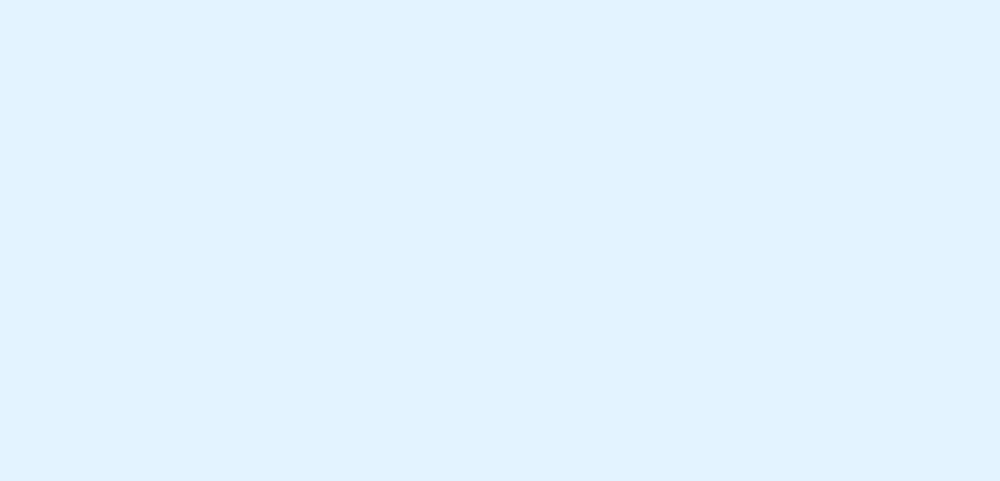

import { MVP } from './lazy-scenes';
import spherePacking from '../../assets/sphere-packing.mp4';
import zOffset from '../../assets/z-offset.mp4';
import focusDistance from '../../assets/focus-distance.mp4';
import extrude from '../../assets/extrude.mp4';

Storybook's version 7.0 is a major milestone, featuring a re-engineered codebase, improved performance, and hundreds of new features. To celebrate, the Storybook team is hosting their first ever user conference—[Storybook Day](https://storybook.js.org/day). To make the occasion even more special, the team wanted to add a visually stunning 3D element to the event landing page.

Using React Three Fiber, we created a 3D illustration that serves as the page's centrepiece. This article explores the finer details of shipping a 3D scene using React Three Fiber. We'll cover a range of topics, including:

- 🏗️ Randomly placing objects without any overlap using sphere packing
- 🧱 Modelling tetris blocks
- 🎥 Adding post-processing effects such as depth of field and shadows
- 🏎️ Performance optimizations to ensure smooth rendering on all devices

<CallOut>
  ℹ️ This post assumes foundational knowledge of React Three Fiber. If you're
  new to 3D or not familiar with the R3F API, check out my{' '}
  <a href="/modular-webgl/">intro post</a> for a primer.
</CallOut>

## Our strategy

The scene consists of extruded text with blocks floating around it. To build the event site, we used NextJS, so it made sense to also use [@react-three/fiber](https://github.com/pmndrs/react-three-fiber). Additionally, [@react-three/drei](https://github.com/pmndrs/drei) provided helpful utilities such as Text3D and Float.

Here's an MVP in code, which will act as our starting point:

<MVP />

<!--  -->

## The Details

On to the fun stuff. Notice how the blocks are randomly spread across the scene and sometimes overlap with the text or each other. It would be aesthetically more pleasing if the blocks had no overlap. That’s one example of little adjustments we made to take this scene from MVP to production ready. Let’s explore these techniques in detail.

### Use sphere packing to place blocks

The [pack-sphere](https://github.com/mattdesl/pack-spheres) library enabled us to evenly distribute the blocks and prevent any potential overlapping issues. This library employs a brute force approach to arrange spheres of varying radii within a cube.

```jsx
const spheres = pack({
  maxCount: 40,
  minRadius: 0.125,
  maxRadius: 0.25,
});
```

Then scale the spheres to our scene space and stretch them horizontally along the x-axis. We then placed a block at the centre of each sphere, scaled to the radius of the sphere.

<SourceCard
  name="Sphere packing to spread out blocks"
  link="https://github.com/storybookjs/storybook-day/blob/main/components/BlocksScene/BlocksScene.tsx#L22"
>
  <Box bg="#323132">
    <Video autoplay loop muted playsInline display="block" mb="0">
      <source src={spherePacking} type="video/mp4" />
    </Video>
  </Box>
</SourceCard>

Fixing the overlap between the "7.0" text and the blocks required a different approach. We considered using [pack-sphere](https://github.com/mattdesl/pack-spheres) to check for collisions between the spheres and the text geometry. In the end, we chose a simpler solution: shifting the spheres slightly along the z-axis.

<SourceCard
  name="Z axis offset to prevent overlapping with text"
  link="https://github.com/storybookjs/storybook-day/blob/main/components/BlocksScene/BlocksScene.tsx#L36"
>
  <Box bg="#323132">
    <Video autoplay loop muted playsInline display="block" mb="0">
      <source src={zOffset} type="video/mp4" />
    </Video>
  </Box>
</SourceCard>

Here's the entire process, in code:

```jsx
// Sphere packing
const spheres = pack({
  maxCount: 40,
  minRadius: 0.125,
  maxRadius: 0.25,
}).map((sphere) => {
  const inFront = sphere.position[2] >= 0;
  return {
    ...sphere,
    position: [
      sphere.position[0],
      sphere.position[1],
      // offset to avoid overlapping with the 7.0 text
      inFront ? sphere.position[2] + 0.6 : sphere.position[2] - 0.6,
    ],
  };
});

const size = 5.5;
// stretch horizontally
const scale = [size * 6, size, size];

const blocks = spheres.map((sphere, index) => ({
  ...sphere,
  id: index,
  // scale position to scene space
  position: sphere.position.map((v, idx) => v * scale[idx]),
  // scale radius to scene space
  size: sphere.radius * size * 1.5,
  color: Random.pick(colors),
  type: Random.pick(blockTypes),
  rotation: new THREE.Quaternion(...Random.quaternion()),
}));
```

## Use extrusion to model tetris blocks

Storybook branding uses tetris style blocks. We'll use the same style for our scene. We'll also add a few more blocks to make the scene more interesting.

<SourceCard
  name="Extrude a tetris block"
  link="https://github.com/storybookjs/storybook-day/blob/main/components/BlocksScene/TetrisBlock.tsx"
>
  <Box bg="#323132">
    <Video autoplay loop muted playsInline display="block" mb="0">
      <source src={extrude} type="video/mp4" />
    </Video>
  </Box>
</SourceCard>

## Add shadows

Next, we'll layer on shadows and depth of field effect to add some oomph.

Contact shadows can add a sense of realism to a 3D scene by creating shadows that accurately reflect the shape of an object and the surface it's resting on. This can be especially useful for creating detailed and realistic scenes with complex geometry.

To add contact shadows to our scene, we can use the ContactShadows component from the @react-three/drei library. First, let's install the library by running the following command in our terminal:

```
npm install @react-three/drei
```

Next, let's import the ContactShadows component and add it to our scene. The ContactShadows component takes care of setting up the necessary render passes and rendering the contact shadows to a texture. It also provides several props that allow us to customize the appearance of the contact shadows, such as resolution and opacity.

```
import { ContactShadows } from '@react-three/drei'

<Canvas>
  <ContactShadows resolution={512} opacity={0.5} />
  {/* Our 3D objects go here */}
</Canvas>
```

Now, when we render our scene, objects that are in contact with other objects or the ground will cast contact shadows that accurately reflect their shape and the surface they're resting on.

You can further customize the appearance of the contact shadows by adjusting the resolution and opacity props. The resolution prop determines the size of the texture used to render the contact shadows, which can affect the quality and performance of the effect. The opacity prop determines the transparency of the contact shadows, which can be useful for fine-tuning the balance between realism and readability.

```
<ContactShadows resolution={1024} opacity={0.7} />
```

Keep in mind that the ContactShadows component requires the presence of a light source in the scene to cast shadows. You can use the DirectionalLight component from Three.js or the PointLight component from React Three Fiber to add a light source to your scene.

That's it! With just a few lines of code, we've added realistic contact shadows to our 3D scene.

I hope this tutorial has helped you get started with adding contact shadows to your 3D scene using the `@react-three/drei` library. If you have any questions or feedback, feel free to leave a comment below. Happy coding!

## Add depth of field effect

<SourceCard
  name="Where to focus within the scene"
  link="https://github.com/storybookjs/storybook-day/blob/main/components/BlocksScene/BlocksScene.tsx#L97"
>
  <Box bg="#323132">
    <Video autoplay loop muted playsInline display="block" mb="0">
      <source src={focusDistance} type="video/mp4" />
    </Video>
  </Box>
</SourceCard>

A depth of field effect can add a sense of realism and depth to a 3D scene by blurring objects that are out of focus.

To add a depth of field effect to our scene, we can use the DepthOfField component from the @react-three/postprocessing library. First, let's install the library by running the following command in our terminal:

```
npm install @react-three/postprocessing
```

Next, let's import the DepthOfField component and add it to our scene. The DepthOfField component takes care of setting up the necessary postprocessing passes and rendering them to a texture. It also provides several props that allow us to customize the depth of field effect, such as focusDistance and aperture.

```
import { DepthOfField } from '@react-three/postprocessing'

<Canvas>
  <DepthOfField focusDistance={2} aperture={0.05} />
  {/* Our 3D objects go here */}
</Canvas>
```

Now, when we render our scene, objects that are closer to the focus distance will be in focus, while objects that are farther away will be blurred.

You can further customize the depth of field effect by adjusting the focusDistance and aperture props. The focusDistance prop determines the distance from the camera at which objects are in focus, and the aperture prop determines the size of the lens aperture, which controls the amount of blur.

You can also use the focalLength prop to adjust the focal length of the camera, which determines the magnification of the image and the distance at which objects are in focus.

```
<DepthOfField focusDistance={2} aperture={0.05} focalLength={50} />
```

That's it! With just a few lines of code, we've added a depth of field effect to our 3D scene.

I hope this tutorial has helped you get started with creating a 3D illustration with React Three Fiber and adding a depth of field effect with the `@react-three/postprocessing` library. If you have any questions or feedback, feel free to leave a comment below. Happy coding!

## Performance optimization: use a material store

## to do…

The Float component from the `@react-three/drei` library allows you to create a floating effect for 3D objects in your scene. This can be useful for creating interactive experiences, such as hover effects or animated transitions.

To use the Float component, you'll first need to install the @react-three/drei library by running the following command in your terminal:

```
npm install @react-three/drei
```

Next, let's import the Float component and wrap it around the 3D object that we want to give a floating effect. The Float component takes care of setting up the necessary animations and applying the floating effect to the object. It also provides several props that allow us to customize the floating effect, such as amplitude and frequency.

```
import { Float } from '@react-three/drei'

<Float amplitude={0.1} frequency={1}>
  {/* Our 3D object goes here */}
</Float>
```

Now, when we render our scene, the 3D object will have a floating effect, moving up and down in a sinusoidal pattern.

You can further customize the floating effect by adjusting the amplitude and frequency props. The amplitude prop determines the height of the floating effect, and the frequency prop determines how quickly the object moves up and down.

```
<Float amplitude={0.2} frequency={2}>
  {/* Our 3D object goes here */}
</Float>
```

Keep in mind that the Float component requires the presence of a parent object with a defined position and rotation. If you want to apply the floating effect to an object that doesn't have a parent object, you can use the Object3D component from Three.js to wrap the object and define its position and rotation.

```
import { Object3D } from 'three'

<Object3D position={[0, 0, 0]} rotation={[0, 0, 0]}>
  <Float amplitude={0.1} frequency={1}>
    {/* Our 3D object goes here */}
  </Float>
</Object3D>
```

That's it! With just a few lines of code, we've added a floating effect to our 3D object.

I hope this tutorial has helped you get started with creating a floating effect for 3D objects using the Float component from the `@react-three/drei` library. If you have any questions or feedback, feel free to leave a comment below. Happy coding!
