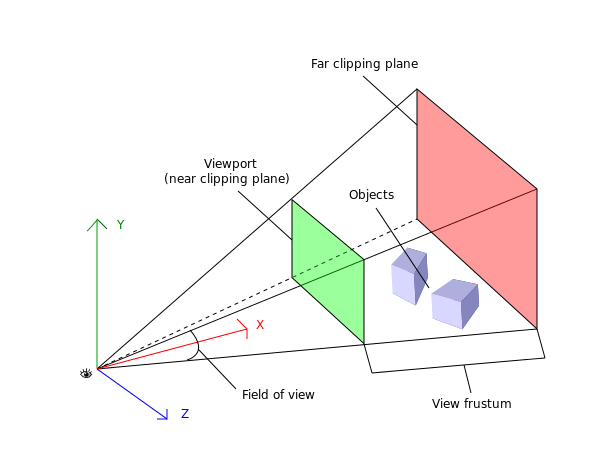

import { MVP, Shadows, DepthOfField } from './lazy-scenes';
import spherePacking from '../../assets/sphere-packing.mp4';
import zOffset from '../../assets/z-offset.mp4';
import focusDistance from '../../assets/focus-distance.mp4';
import extrude from '../../assets/extrude.mp4';
import storybook7Mp4 from '../../assets/storybook-7.mp4';

<SourceCard name="Storybook Day" link="https://storybook.js.org/day">
  <Video autoplay loop muted playsInline display="block" mb="0">
    <source src={storybook7Mp4} type="video/mp4" />
  </Video>
</SourceCard>

Storybook just hit a major milestone: version 7.0! With a re-engineered codebase and bunch of new features, it's faster and more stable than ever before. To celebrate, the team hosted their first ever user conference—[Storybook Day](https://storybook.js.org/day). And to make things even more special, we decided to add a visually stunning 3D element to the event landing page.

We used React Three Fiber to build an eye-catching 3D illustration, inspired by Storybook's Tetris blocks branding. In this article, we'll dive into the nitty-gritty of shipping a 3D scene. Here's what we'll cover:

- 🏗️ Avoid object overlap with sphere packing
- 🧱 Model Tetris blocks with extrusion
- 🎥 Enhance visuals with post-processing effects like depth of field and shadows
- 🏎️ Optimize performance for glitch-free rendering on all devices

<CallOut>
  ℹ️ This post assumes foundational knowledge of React Three Fiber. If you're
  new to 3D or not familiar with the R3F API, check out my{' '}
  <a href="/modular-webgl/">intro post</a> for a primer.
</CallOut>

## Our strategy

To build the event site, we used NextJS and [@react-three/fiber](https://github.com/pmndrs/react-three-fiber), with a little help from [@react-three/drei](https://github.com/pmndrs/drei). This allowed us to create an eye-catching 3D scene, complete with floating Tetris blocks and extruded text.

Here's an MVP in code, that was our starting point:

<MVP />

## The Details

On to the fun stuff. Notice how the blocks are randomly spread across the scene and sometimes overlap with the text or each other. It would be aesthetically more pleasing if the blocks had no overlap. That's one example of little adjustments we made to take this scene from MVP to production ready. Let's explore these techniques in detail.

### Sphere packing to place blocks

The [pack-sphere](https://github.com/mattdesl/pack-spheres) library enabled us to evenly distribute the blocks and prevent any potential overlapping issues. This library employs a brute force approach to arrange spheres of varying radii within a cube.

```js
const spheres = pack({
  maxCount: 40,
  minRadius: 0.125,
  maxRadius: 0.25,
});
```

We then scaled the spheres to fit our scene space and stretched them horizontally along the x-axis. Lastly, we placed a block at the center of each sphere, scaled to the sphere's radius.

<SourceCard
  name="Sphere packing to spread out blocks"
  link="https://github.com/storybookjs/storybook-day/blob/main/components/BlocksScene/BlocksScene.tsx#L22"
>
  <Box bg="#323132">
    <Video autoplay loop muted playsInline display="block" mb="0">
      <source src={spherePacking} type="video/mp4" />
    </Video>
  </Box>
</SourceCard>

Fixing the overlap between the "7.0" text and the blocks required a different approach. We considered using [pack-sphere](https://github.com/mattdesl/pack-spheres) to check for collisions between the spheres and the text geometry. In the end, we chose a simpler solution: shifting the spheres slightly along the z-axis.

<SourceCard
  name="Z axis offset to prevent overlapping with text"
  link="https://github.com/storybookjs/storybook-day/blob/main/components/BlocksScene/BlocksScene.tsx#L36"
>
  <Box bg="#323132">
    <Video autoplay loop muted playsInline display="block" mb="0">
      <source src={zOffset} type="video/mp4" />
    </Video>
  </Box>
</SourceCard>

Here's the entire process, in code:

```js
// Sphere packing
const spheres = pack({
  maxCount: 40,
  minRadius: 0.125,
  maxRadius: 0.25,
}).map((sphere) => {
  const inFront = sphere.position[2] >= 0;
  return {
    ...sphere,
    position: [
      sphere.position[0],
      sphere.position[1],
      // offset to avoid overlapping with the 7.0 text
      inFront ? sphere.position[2] + 0.6 : sphere.position[2] - 0.6,
    ],
  };
});

const size = 5.5;
// stretch horizontally
const scale = [size * 6, size, size];

const blocks = spheres.map((sphere, index) => ({
  ...sphere,
  id: index,
  // scale position to scene space
  position: sphere.position.map((v, idx) => v * scale[idx]),
  // scale radius to scene space
  size: sphere.radius * size * 1.5,
  color: Random.pick(colors),
  type: Random.pick(blockTypes),
  rotation: new THREE.Quaternion(...Random.quaternion()),
}));
```

### Extrusion to model tetris blocks

You may have noticed that we've only used primitive blocks so far. Hey, no hating on primitives, but Storybook branding uses tetris-style blocks, so we had to add those into the mix.

Three.js has the concept of [ExtrudeGeometry](https://threejs.org/docs/#api/en/geometries/ExtrudeGeometry). You can provide it with a 2D shape, using a syntax similar to SVG path or CSS shapes. It then extrudes it along the z-axis, which is perfect for tetris blocks.

<SourceCard
  name="Extrude a tetris block"
  link="https://github.com/storybookjs/storybook-day/blob/main/components/BlocksScene/TetrisBlock.tsx"
>
  <Box bg="#323132">
    <Video autoplay loop muted playsInline display="block" mb="0">
      <source src={extrude} type="video/mp4" />
    </Video>
  </Box>
</SourceCard>

The Extrude utility from Drei provides a convenient syntax for creating such shapes. For example, the "T" block was generated as follows:

```jsx
import { useMemo } from 'react';
import * as THREE from 'three';
import { Extrude } from '@react-three/drei';

export const EXTRUDE_SETTINGS = {
  steps: 2,
  depth: 0.5625,
  bevelEnabled: false,
};

export const TBlock = ({ type, color, ...props }) => {
  const shape = useMemo(() => {
    const _shape = new THREE.Shape();
    _shape.moveTo(0, 0);
    _shape.lineTo(SIDE, 0);
    _shape.lineTo(SIDE, SIDE * 3);
    _shape.lineTo(0, SIDE * 3);
    _shape.lineTo(0, SIDE * 2);
    _shape.lineTo(-SIDE, SIDE * 2);
    _shape.lineTo(-SIDE, SIDE);
    _shape.lineTo(0, SIDE);
    return _shape;
  }, []);

  return (
    <Extrude args={[shape, EXTRUDE_SETTINGS]} {...props}>
      <meshPhongMaterial color={color} />
    </Extrude>
  );
};
```

Next, we layered on shadows and depth of field effect to add some oomph.

### Shadows

Shadows bring scenes to life by adding depth and realism. You can configure lights and meshes within the scene to cast shadows using the [`castShadow`](https://threejs.org/docs/#api/en/lights/DirectionalLight.castShadow) prop. However, we were looking for a softer look, so once again we reached for Drei, which offers a convenient contact shadows component.

Contact shadows is a "fake shadow" effect. It films the scene from below and renders the shadow into a catcher plane. The shadow is accumulated over several frames and is often softer and more realistic.

To use it, add the `ContactShadows` component to the scene. Then customize the look by adjusting the resolution, opacity, blur, color, and other properties.

<Shadows />

### Depth of field effect

At this stage, every object in the scene is rendered with the same sharpness, making the scene appear somewhat flat. Photographers, often use wide apertures and shallow depth of field to create a pleasing blurred aesthetic. We mimicked this effect by applying post-processing effects—using [@react-three/postprocessing](https://docs.pmnd.rs/react-postprocessing/introduction)—to our scene, giving it a more cinematic feel.

The [EffectComposer](https://pmndrs.github.io/postprocessing/public/docs/class/src/core/EffectComposer.js~EffectComposer.html) manages and runs post-processing passes. It begins by rendering the scene to a buffer and then applies filters and effects one at a time before rendering the final image onto the screen.

#### Picking a focus distance

With the DepthOfField effect, you can pinpoint a specific distance (`focusDistance`) within your scene and make everything else beautifully blurry. But how do you define the focus distance? Is it measured in world units or something else?

```jsx
import { Canvas } from '@react-three/fiber';
import { EffectComposer, DepthOfField } from '@react-three/postprocessing';

export const Scene = () => (
  <Canvas>
    {/* Rest of Our scene */}
    <EffectComposer multisampling={8}>
      <DepthOfField focusDistance={0.5} bokehScale={7} focalLength={0.2} />
    </EffectComposer>
  </Canvas>
);
```

The camera's view is defined by a pyramid-shaped volume called the "view frustum." Objects within the minimum (near plane) and maximum (far plane) distances from the camera will be rendered.

<figure px="4">
  
  <figcaption>
    <a href="https://obviam.net/posts/2011/06.3d-perspective-projections/">
      From: Intro to 3D Programming - Perspective Projections
    </a>
  </figcaption>
</figure>

The `focusDistance` parameter determines the distance from the camera at which objects are considered in focus. Its value is normalized between 0 and 1, where 0 represents the near plane of the camera and 1 represents the far plane.

<SourceCard
  name="Where to focus within the scene"
  link="https://github.com/storybookjs/storybook-day/blob/main/components/BlocksScene/BlocksScene.tsx#L97"
>
  <Box bg="#323132">
    <Video autoplay loop muted playsInline display="block" mb="0">
      <source src={focusDistance} type="video/mp4" />
    </Video>
  </Box>
</SourceCard>

We set the focus distance to 0.5, which is where the text is located. Objects closer to that threshold will be in focus, while those farther away will be blurred. Try adjusting the `focusDistance` slider in the sandbox below to see how it affects the scene.

You can also further customize this effect by adjusting the `bokehScale` and `focalLength` props.

<DepthOfField />

### Using a material store for performance optimization

Although shadows and depth of field are cool visual effects, they can be quite expensive to render and have a significant impact on performance. Seeking some advice on this topic, I reached out to [Paul Henschel aka @0xca0a](https://twitter.com/0xca0a). Among several perf optimizations, he suggested using a material store to avoid creating a new material instance for each block. Let's take a closer look at how this works.

The Block component uses the `color` prop to create a unique material for every instance. For example, every orange coloured block will have its own material instance. Pretty wasteful, right?

```jsx
export const Block = ({ type, color }: BlockProps) => {
  const Component = BLOCK_TYPES[type].shape
  return (
    <Component args={BLOCK_TYPES[type].args as any} castShadow>
      <meshPhongMaterial color={color} />
    </Component>
  )
}
```

By using a material store, we could reuse the same material across multiple block instances. This improved performance by reducing the number of materials that need to be created and rendered.

```jsx:title=src/components/BlocksScene/store.tsx
import * as THREE from 'three';
THREE.ColorManagement.legacyMode = false;

const colors: string[] = [
  '#FC521F',
  '#CA90FF',
  '#1EA7FD',
  '#FFAE00',
  '#37D5D3',
  '#FC521F',
  '#66BF3C',
  '#0AB94F'
];

interface Materials {
  [color: string]: THREE.MeshPhongMaterial;
}

const materials: Materials = colors.reduce(
  (acc, color) => ({ ...acc, [color]: new THREE.MeshPhongMaterial({ color }) }),
  {}
);

export { colors, materials };
```

The store generates a material for every possible block color and stores it in a plain object. Now, instead of creating a material for each instance, the block component simply references it from the material store. We went from 40 materials to 8.

```jsx
export const Block = ({ type, color }: BlockProps) => {
  const Component = BLOCK_TYPES[type].shape;
  return (
    <Component
      args={OTHER_TYPES[type as OtherBlockType].args as any}
      material={materials[color]}
    />
  );
}
```

## Wrap up

3D is now part of the web's grain, and R3F is a fantastic tool for intertwining HTML and WebGL. The R3F ecosystem is rich, and libraries like drei and postprocessing simplify complex 3D tasks. The Storybook Day 3D scene perfectly showcases the platform's possibilities. We used sphere packing, extrusion, shadows, depth of field, and a material store to create an memorable event landing page.

In deconstructing this scene, I aimed to shed light on the final 20% of work that elevates a scene from "done" to "ready to ship". If you have any questions or feedback, feel free to reach out via [twitter](https://twitter.com/winkerVSbecks).

Want to dive in deeper? The code is open-source and each aspect of the scene is broken down in the deployed Storybook.

- 👨🏽‍💻 [GitHub repository](https://github.com/storybookjs/storybook-day/tree/main/components/BlocksScene)
- 📚 [Deployed Storybook](https://main--6383d84cd73a2a81d33248b2.chromatic.com)
- 🌏 [Live site](https://storybook.js.org/day)
