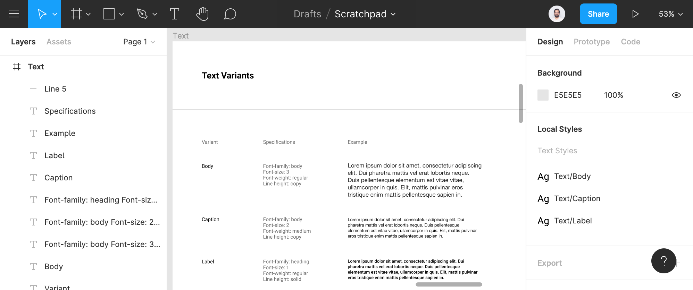

import ComponentHierarchy from './component-hierarchy';
import StyledSystemExample from './styled-system-example';

Much has changed in the world of Styled System since my last [post](https://varun.ca/styled-system). There are fewer packages to deal with; it is much more performant and has a more straightforward and powerful API. I recently helped build Rangle's open-source design system kit, [Radius](https://rangle.io/radius). We used Styled System, and it was a great experience. It remains my preferred tool for building design systems. However, I did have to update my understanding of the tool and adopt newer architectural patterns.

## The Design Graph

The foundation of the Styled System API is the [Design Graph](https://jxnblk.com/blog/design-graph) — a constraint-based system for organizing styles in UI design. It consists of four parts: scales, theme, variants and components.

### Scales

Design Tokens is a [familiar](https://www.youtube.com/watch?v=wDBEc3dJJV8) term by now. They define the visual characteristics of a brand or a product such as typography, colours, icons, and spacing. They make it easier to maintain a scalable, consistent system for UI development.

Design tokens can have a broad set of responsibilities. They span both design tools & code and can support multiple render targets such as the web, iOS, Android and even embedded devices. You can think of scales as a subset of design tokens that map to specific CSS style properties. For example, typography tokens can map to font-size, font-weight and line-height scales.

### Theme

The theme is a collection of all the scales and is maintained in a `theme.ts` file. The shape of this theme object conforms to the [System UI Theme Specification](https://system-ui.com/theme).

You might have multiple versions of the theme. For example, to switch between different brands or perhaps colour modes (dark & light). Radius is excellent real-world [example](https://github.com/rangle/radius/blob/d21532c3cfa05137dd71f0b0601f44e5d40d57d8/packages/ds/src/theme.ts).

### Components

Components allow you to split the UI into independent and reusable pieces. Styled System provides functions to connect component styles to the scales.

```js
// styled-components is a CSS-in-JS Library
import styled from 'styled-components';

// styled-system provides functions that add props to React components
// which allow you to control styles based on design tokens.
import { space, layout, color } from 'styled-system';

// The Box component is now connected to Space and Color tokens
export const Box = styled.div(space, color);
```

Now, this component will have style props available to set foreground color, background color, margin and padding values.

```js
/**
 * Color maps to theme.colors.textEditorial
 * background color maps to theme.colors.background[1]
 * Padding maps to theme.space[3]
 */
<Box color="textEditorial" bg="bg.primary" p={3}>
  Tomato
</Box>
```

### Variants

There are situations where you might want to support slight stylistic variations of components. For example, a button might have primary, secondary and transparent variants.

Styled System variants allow you to apply a set of visual styles to a component using a single prop.

Let's consider typography variants. In Figma, you define reusable typography as text styles. A text style has predefined values for font-family, size, weight and line-height.



In code, use the [variant](https://styled-system.com/variants) function to define typography variants.

```js:title=text.ts
const textVariants = variant({
  variants: {
    body: {
      fontFamily: 'body',
      fontWeight: 'regular',
      lineHeight: 'copy',
      fontSize: 2,
    },
    caption: {
      fontFamily: 'body',
      fontWeight: 'medium',
      lineHeight: 'copy',
      fontSize: 2,
    },
    label: {
      fontFamily: 'heading',
      fontWeight: 'regular',
      lineHeight: 'solid',
      fontSize: 1,
    },
  },
});

export const Text = styled.p`
  ${compose(
    space,
    color,
    typography
  )}
  ${textVariants}
`;
```

These variants map back to the scales.

```js:title=theme.ts
{
  fonts: {
    body: '"Helvetica Neue", sans-serif',
    heading: '"Roboto", sans-serif',
  },
  fontWeights: {
    regular: 400,
    medium: 500,
    bold: 700,
  },
  lineHeights: {
    solid: 1,
    title: 1.25,
    copy: 1.5,
  },
  fontSizes: [12, 14, 16, 20, 24, 32, 48]
}
```

The Text component can now use the `variant` prop to switch between lead, body and label styles.

```js
<Text variant="body" />
<Text variant="caption" />
<Text variant="label" as="span" />
```

## Example

Let's look at a complete example. The Field component here is a composition of the Input, Label and Text components, which, in turn, use a composition of scales and variants. The Hint and Error texts are the Text component with the variant set to hint and different colour values.

<StyledSystemExample />

```js
export const Field = () => (
  <Box>
    <Label htmlFor="my-input" required>
      Label text
    </Label>
    <Input
      placeholder="Placeholder Text"
      id="my-input"
      aria-describedby="helper-text error-text"
    />
    <Text variant="hint" color="text.secondary" id="helper-text">
      Hint text
    </Text>
    <Text variant="hint" color="text.error" id="error-text">
      Error text
    </Text>
  </Box>
);
```

## Component Heirarchy

Not all components are built the same way. A component might be created using styled-components or a combination of styled-components and Styled System or as a composition of other components. I recommend using the following hierarchy to reason as to what technique to use for creating components.

<ComponentHierarchy />

- **Elements** are basic reusable building blocks of the system.
- **Patterns** are reusable building blocks made up of elements or other patterns.
- **Features** are a set of patterns, elements, & styles that come together to support a specific user task. Sometimes referred to as container components.
- **Layouts** are how features come together to form a page.

The design system would generally be limited to Elements and Patterns. Ideally, you should define Features and Layouts in the application. There are some scenarios in which you might want to include _recipes_ to demonstrate how one might build a particular Feature — for example, the [form control recipes](https://radius-ds.netlify.com/?path=/docs/components-formcontrol-recipes--validation) in Radius.

Note, this is a framework for guiding architectural choices. I _do not_ recommend categorizing components in code. A component might start as an Element and evolve into a Pattern. Category based folder structure leads to unnecessary overhead and can hinder this natural evolution.

### Forwarding Refs

Each component should return a single HTML element that accepts all HTML props, including `className`, `style` and accessibility attributes. Which means you need to consider ref forwarding.

> Encapsulation is desirable for application-level components (Features), it can be inconvenient for highly reusable “leaf” components like FancyButton or MyTextInput. These components tend to be used throughout the application in a similar manner as a regular DOM button and input, and accessing their DOM nodes may be unavoidable for managing focus, selection, or animations.
>
> Ref forwarding is an opt-in feature that lets some components take a ref they receive, and pass it further down (in other words, “forward” it) to a child.
>
> — [Forwarding Refs](https://reactjs.org/docs/forwarding-refs.html)

### Elements

An element is a styled-component that uses functions from Styled System. Styled-components handles ref forwarding here. These are polymorphic components, i.e., keeping the styling same they allow you to render a different HTML tag or a different custom component.

```js
const textVariants = variant({
  variants: {
    big: {
      fontSize: 4,
      lineHeight: 'heading',
    },
    small: {
      fontSize: 1,
      lineHeight: 'body',
    },
  },
});

export const Text = styled.p(
  textVariants,
  compose(
    space,
    color,
    layout,
    flexbox,
    border,
    position,
    typography
  )
);
```

### Patterns

Patterns are comprised of elements. Therefore, we have to pick which component ref to forward.

```js
import { StyledComponentProps } from 'styled-components';

type AspectRatioProps = StyledComponentProps<
  'div',
  any,
  {
    /** The aspect ratio to apply */
    ratio?: number;
  } & BoxProps,
  never
>;

export const AspectRatio = forwardRef<HTMLDivElement, AspectRatioProps>(
  ({ ratio = 16 / 9, children, ...props }, ref) => (
    <Box ref={ref} position="relative" overflow="hidden">
      <Box width="100%" height={0} pb={100 / ratio + '%'} />
      <Box {...props} position="absolute" top={0} right={0} bottom={0} left={0}>
        {children}
      </Box>
    </Box>
  )
);
```

Here `StyledComponentProps` is a utility to create types for a styled component. It merges the typings for style function props and the typings of the HTML element being forwarded.

Constraint-based Style Props has been a revolutionary idea. It allows us to truly reason about our UI as a system. For more real-world examples of components, check out the [Radius source code](https://github.com/rangle/radius/tree/master/packages/ds/src/components).
