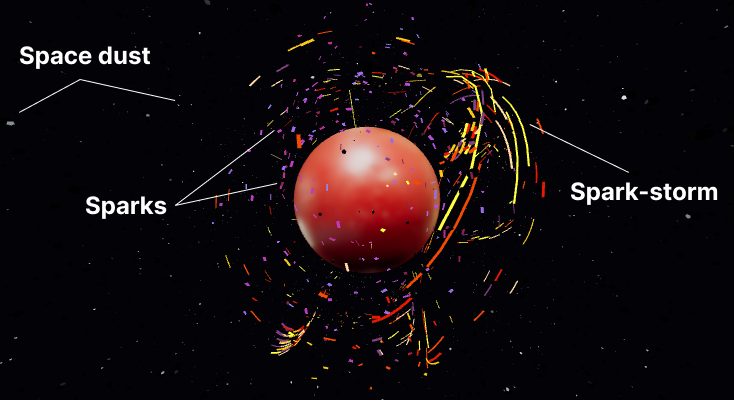
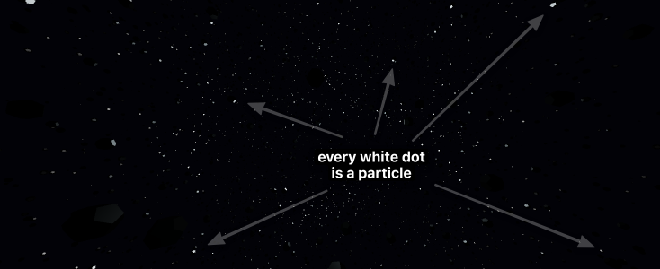

import {
  SpaceDust,
  Sparks,
  SparkStorm,
  SolarStorm,
  SparksBasicDemo,
  SparkStormBasicDemo,
} from './lazy-scenes';
import lorenzAttractorGif from '../../assets/lorenz-attractor.gif';

<SolarStorm />

Particles will never not be cool! I've been obsessed with them since the day I was introduced to generative art. They're super versatile. You can use them for all kinds of things—flock of birds, snow, fire, fireworks, stars, sparks and so on. I've shown you how to build a [confetti particle system](/confetti) in the past. This time we're entering the third dimension.

I'll break down the demo you see above and share three techniques for creating particle systems:

1. Using instanced meshes and animating their transforms.
2. Using dashed lines with an animated offset.
3. By drawing a line and advancing it step by step.

<CallOut>
  ⚠️ This post assumes foundational knowledge of React Three Fiber. If you're
  new to 3D or not familiar with the R3F API, check out my{' '}
  <a href="/modular-webgl/">intro post</a> for a primer.
</CallOut>

## What are we building?



The demo above consists of three particle systems. The space dust moving around in the background. Sparks gently floating around the planet. And the spark storm that engulfs the planet.

Let's tackle them one by one.

## Instanced meshes

First up is the Space Dust system. It's just a bunch of dodecahedrons oscillating around a point. The classical approach is to have one object per particle. But you're usually dealing with hundreds of thousands of particles, and it's hard to render them all in a performant way. That's where instanced meshes come in.



The Space Dust system consists of ten thousand particles. That would mean ten thousand draw calls. With [InstancedMesh](https://threejs.org/docs/?q=inst#api/en/objects/InstancedMesh), we can cut that down to a single draw call. It accomplishes this by reusing the geometry but applying a unique transformation for each instance.

We start by creating a bunch of particles with a random position, speed and timing.

```js
const particles = useMemo(() => {
  const temp = [];
  for (let i = 0; i < count; i++) {
    const time = Random.range(0, 100);
    const factor = Random.range(20, 120);
    const speed = Random.range(0.01, 0.015) / 2;
    const x = Random.range(-50, 50);
    const y = Random.range(-50, 50);
    const z = Random.range(-50, 50);

    temp.push({ time, factor, speed, x, y, z });
  }
  return temp;
}, [count]);
```

Then render them all using a single `instancedMesh`.

```js
<>
  <pointLight ref={light} distance={40} intensity={8} color="lightblue" />
  <instancedMesh ref={mesh} args={[null, null, count]}>
    <dodecahedronBufferGeometry args={[0.2, 0]} />
    <meshPhongMaterial color="#050505" />
  </instancedMesh>
</>
```

You can see that they start off distributed all across the screen.

<SpaceDust />

We can then update the particle position, scale, and rotation on every frame to create the oscillating motion. For this, we use a dummy object to calculate the updated transformation matrix and then apply that to the particle instance using the `setMatrixAt` call.

Now go ahead and toggle on the animations (in the demo above) to see how the movement builds up.

```js
const dummy = useMemo(() => new THREE.Object3D(), []);

useFrame(() => {
  // Run through the list of particles calculate some movement
  particles.forEach((particle, index) => {
    let { factor, speed, x, y, z } = particle;

    // Update the particle time
    const t = (particle.time += speed);

    // Update the particle position based on the time
    dummy.position.set(
      x + Math.cos((t / 10) * factor) + (Math.sin(t * 1) * factor) / 10,
      y + Math.sin((t / 10) * factor) + (Math.cos(t * 2) * factor) / 10,
      z + Math.cos((t / 10) * factor) + (Math.sin(t * 3) * factor) / 10
    );

    // Derive an oscillating value for size and rotation
    const s = Math.cos(t);
    dummy.scale.set(s, s, s);
    dummy.rotation.set(s * 5, s * 5, s * 5);
    dummy.updateMatrix();

    // And apply the matrix to the instanced item
    mesh.current.setMatrixAt(index, dummy.matrix);
  });
  mesh.current.instanceMatrix.needsUpdate = true;
});
```

The output for `sin` and `cos` functions yo-yos between -1 and 1, making them perfect for generating an oscillating motion. You can even combine these trigonometric functions (by adding or multiplying them) to create more interesting repeating patterns. That's what I've done for the position animation.

## Dashed line with animated offset

<SparksBasicDemo />

Moving on to the floating sparks. The second technique is a bit of a sleight of hand. Instead of creating particle objects, we'll draw lines and animate the dash offset to make it appear like particles. Kind of like those [SVG line animations](https://css-tricks.com/svg-line-animation-works/) but in 3D. This is trick works exceptionally well when you want particles to move along a path.

So, how does it work? It's a three step process:

1. Generate a bunch of points
2. Use `THREE.CatmullRomCurve3` to convert them into a curve
3. Draw the curve using `THREE.MeshLine` and animate the `dashOffset`

Repeat this process for each line.

<Sparks />

You can play around with the dash ratio, line count and thickness to create different effects.

How you generate the points totally changes the effect. You can use a mathematical equation like polynomials or bezier curves. In my case, I decided to go with a [polar coordinates](/polar-coords) approach.

We'll increment the angle step-by-step from `0` to `2 PI` radians and use it to calculate the `(x,y)` coordinates and keep `z` as `0`. Most importantly, adding a bit of variance to the radius for a more organic look.

```js{12-24}
const radiusVariance = () => Random.range(0.2, 1);

const lines = useMemo(
  () =>
    new Array(lineCount).fill().map((_, index) => {
      // starting position
      const pos = new THREE.Vector3(
        Math.sin(0) * radius * radiusVariance(),
        Math.cos(0) * radius * radiusVariance(),
        0
      );
      // Increment the angle to create the points
      const points = new Array(30).fill().map((_, index) => {
        const angle = (index / 20) * Math.PI * 2;

        return pos
          .add(
            new THREE.Vector3(
              Math.sin(angle) * radius * radiusVariance(),
              Math.cos(angle) * radius * radiusVariance(),
              Math.sin(angle) * Math.cos(angle) * radius * radiusVariance()
            )
          )
          .clone();
      });
      // convert points into a curve
      const curve = new THREE.CatmullRomCurve3(points).getPoints(1000);

      return {
        color: colors[parseInt(colors.length * Math.random(), 10)],
        width: Math.max(0.1, (0.2 * index) / 10),
        speed: Math.max(0.001, 0.004 * Math.random()),
        curve,
      };
    }),
  [count, colors, radius]
);
```

Lastly, we can draw each line and animate the `dashOffset` value using the `useFrame` hook.

```jsx{4-6}
function SparkLine({ curve, width, color, speed }) {
  const material = useRef();

  useFrame(() => {
    material.current.uniforms.dashOffset.value -= speed;
  });

  return (
    <mesh>
      <meshLine attach="geometry" points={curve} />
      <meshLineMaterial
        ref={material}
        transparent
        depthTest={false}
        lineWidth={width}
        color={color}
        dashArray={0.1}
        dashRatio={0.95}
      />
    </mesh>
  );
}
```

My go-to option for drawing 3D lines is [THREE.MeshLine](https://github.com/spite/THREE.MeshLine). It's a fantastic feature-rich library. However, it doesn't yet support Three.js version 128 and up. But, worry not, I've included a patched up version in my demo repo that you can use instead: [3d-particle-effects-demo/tree/main/src/MeshLine](https://github.com/winkerVSbecks/3d-particle-effects-demo/tree/main/src/MeshLine)

## Advance (move) a line

<SparkStormBasicDemo />

Lastly, we have the Spark Storm. With particles buzzing around the planet in a peculiar motion. This requires a technique related to the previous one. However, instead of relying on a dash offset, we'll draw a line and then animate it using a mathematical system. This is a bit more involved, but a whole lot more fun!

You can use all kinds of mathematical models to create the movement. I decided to go with [Attractors](https://en.wikipedia.org/wiki/Attractor) mapped to the surface of a sphere. You've likely seen these attractors before. The Lorenz attractor creates this famous butterfly-like curve.

<SourceCard
  name="Lorenz attractor by Dan Quinn"
  link="https://en.wikipedia.org/wiki/Lorenz_system#/media/File:A_Trajectory_Through_Phase_Space_in_a_Lorenz_Attractor.gif"
>
  <Box bg="#fff" py={4}>
    <Image
      mb={0}
      src={lorenzAttractorGif}
      alt="A sample trajectory through phase space is plotted near a Lorenz attractor"
    />
  </Box>
</SourceCard>

```js
const newPosition = attractor(currentPosition, timeStep);
```

We're not going to get into the math behind attractors. For our purposes, an attractor is simply a function that uses the current position and a time step value to calculate the next location for a point.

Notice how that ball moves along the attractor. We'll use this effect to power our particle system by tracking multiple points on the attractor. Then connect those points to draw a line.

<SparkStorm />

We start with an initial, randomly generated, list of positions. Then use the attractor to calculate a new position on each frame. We then drop the last position in the list to advance the line and push this new position in. THREE.MeshLine has a handy `advance` function built in that does this for you.

```jsx
function StormLine({ radius, simulation, width, color }) {
  const line = useRef();

  // Create the points
  const [positions, currentPosition] = useMemo(() => createAttractor(5), []);

  // Move the points
  useFrame(() => {
    if (line.current) {
      const nextPosition = updateAttractor(
        currentPosition,
        radius,
        simulation,
        0.005
      );

      line.current.advance(nextPosition);
    }
  });

  // Draw the line
  return (
    <mesh>
      <meshLine ref={line} attach="geometry" points={positions} />
      <meshLineMaterial transparent lineWidth={width} color={color} />
    </mesh>
  );
}
```

There are many [different attractors](https://fusefactory.github.io/openfuse/strange%20attractors/particle%20system/Strange-Attractors-GPU/), and each produces a different kind of curve. The system randomly picks an attractor for each line of the Spark Storm, which adds a good amount of variation to the animation and makes for a pretty cool effect!

The other significant bit here is to map the positions to the surface of a sphere. With vectors, that's as simple as normalizing and scaling the vector. Without this, the particles will fly all over the place, and I wanted to make it look like they were engulfing a planet.

```js
const normalizedPosition = currentPosition
  .clone()
  .normalize()
  .multiplyScalar(scale);
```

This is probably my favourite technique because you can change the mathematical model to create totally different effects. For example, you could use a [flocking algorithm](https://www.youtube.com/watch?v=mhjuuHl6qHM) or [noise](/noise) instead of attractors.

## Wrapping up

Thanks for following along. I hope breaking down these techniques will encourage you to make your own awesome particle systems. Do share them with me on Twitter [@winkerVSbecks](https://twitter.com/winkerVSbecks) — I love seeing what you all make!

The complete source code is available at [github.com/winkerVSbecks/3d-particle-effects-demo](https://github.com/winkerVSbecks/3d-particle-effects-demo).

Want to dive deeper? Several particle effect examples are available on the [Three.js ](https://threejs.org/examples/?q=particles#webgl_points_billboards) and [React Three Fiber](https://docs.pmnd.rs/react-three-fiber/getting-started/examples) sites. Also, Codrops has [many excellent tutorials](https://tympanus.net/codrops/?s=particles&search-type=posts) on this topic.
