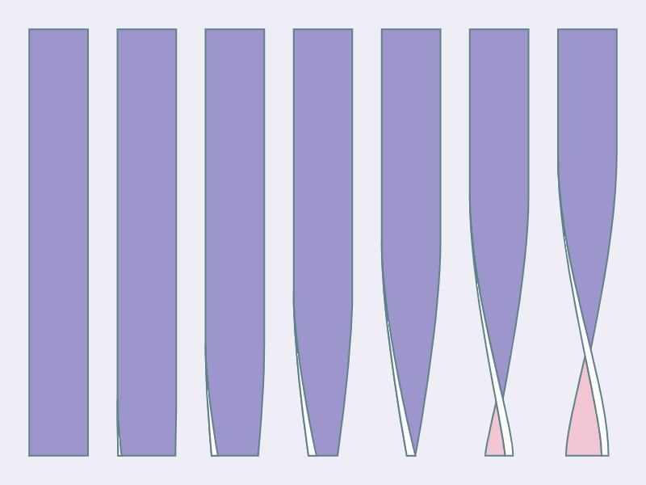

import { Scroller } from '@components/scroller';
import torsionsByWalterLeblanc from '../assets/torsions/torsions-by-walter-leblanc-2.jpg';
import edgeCurveAnimated from '../assets/torsions/edge-curve-animated.gif';
import edgeCurve from '../assets/torsions/edge-curve.png';
import edgeCurveBottomAnimated from '../assets/torsions/edge-curve-bottom-animated.gif';
import edgeCurveCpAnimated from '../assets/torsions/edge-curve-cp-animated.gif';
import edgeCurveAnimatedCombined from '../assets/torsions/edge-curve-animated-combined.gif';
import doubleCurve from '../assets/torsions/double-curve.gif';
import edgeThickness from '../assets/torsions/edge-thickness.gif';
import faceAndEdge from '../assets/torsions/face-and-edge.gif';
import edgeThicknessPerspective from '../assets/torsions/edge-thickness-perspective.gif';
import intersections from '../assets/torsions/intersections.gif';
import edgeCurveSplit from '../assets/torsions/edge-curve-split.gif';
import final from '../assets/torsions/final.gif';

export const figures = [
  ,
  ,
  ,
  <>
    
    
  </>,
  ,
  <>
    
    
  </>,
  <>
    
    
  </>,
  ,
  <>
    
    
  </>,
  ,
];


<figure bg="#EFEDF5" py="4">
  
</figure>

One of my favourite forms of creative coding is to add motion to static images. The process is always the same: pick an image, recreate it with Canvas, SVG or WebGL and animate aspects of its geometry. The image above is a good example. It's based on Walter Leblanc's print [_Torsions_](https://www.vintage-design-point.be/product/abstract-lithograph-torsie-vorming-in-6-phasen-by-walter-leblanc-1978-69-150/). In this post I'm going to break down the process of creating this animation. And share 2D techniques that I often use in my work.

## Torsions

My go-to tool for creative coding these days is [canvas-sketch](https://github.com/mattdesl/canvas-sketch). It is both a dev enviornment and a framework for creating generative art. By default, it allows you to create pieces using the Canvas API. However, you can also pair it with other graphics libraries like ThreeJS, p5.js, d3, etc. And most importantly it allows you to export high-resolution PNGs, animated GIFs or even render videos.

I'll do a detailed dive into canvas-sketch in a future post. However, for now all you need to know is overall structure of the program. The `settings` object controls the dimensions and other characteristics of the animation. The `sketch` function recieves the canvas `context` and other props such as canvas `width`, `height`, `playhead`, etc. This is where you also define the actual draw loop. Most of your code will live inside that.

```js:title=hello.js
// Import the library
const canvasSketch = require('canvas-sketch');

// Specify some output parameters
const settings = {
  // The [ width, height ] of the artwork in pixels
  dimensions: [ 256, 256 ],
  // Is it animated and the duration of the animation
  animate: true,
  duration: 6,
};

// Start the sketch
const sketch = () => {
  // The draw loop
  return (props) => {
    // Destructure what we need from props
    const { context, width, height } = props;

    // Now draw a white rectangle in the center
    context.strokeStyle = 'white';
    context.lineWidth = 4;
    context.strokeRect(width / 4, height / 4, width / 2, height / 2);
  };
};

// Start the sketch with parameters
canvasSketch(sketch, settings);
```

<Scroller
  width={300}
  figures={figures}>

### 1. Getting Started

Our starting point in the original image. This is an ideal scenario. The image essentially gives you keyframes for what the animation should look like. Usually, we’re not that lucky. To figure out what to animate requires a bit more imagination.


So, what exactly is going on here? I see a block of some thickness. The top edge remains fixed while the bottom twists back and forth. As the block twists, the edge warps and creates the tapered look you see on the far right.

All in all, I see three parts: the beige front face, the blue back face and the front-facing edge.

### 2. Simplified Case — No Thickness

Let's reduce this down to the simplest scenario, a flat 2D rectangle that is twisting around. As with hand-drawing, learning to draw with code requires you to observe an object and describe it in terms of lines and curves.


I see a rectangle with the bottom two vertices oscillating left and right. And the two vertical edges go from a straight line to a curve and then back again.

What is that curve?

### 3. Edge Curve

To me this looks a like a cosine wave. There is no cosine path API for Canvas, however, you can draw it using the [bezier path API](https://developer.mozilla.org/en-US/docs/Web/API/CanvasRenderingContext2D/bezierCurveTo).


A bezier curve requires four points: start, end and two control points. This should be quite familiar if you've ever worked with vector paths in Illustrator, Sketch or Figma. Now, we know the start and endpoints. They are two vertices of the rectangle.

So, what about the control points? A quick google took me to this Stackoverflow [answer](https://stackoverflow.com/a/29214613). Here's how you can calculate the two control points:

```js
// Where (x1, y1) is the start and (x2, y2) the end points
const K = 0.37;

const cp1 = [x1, y1 + K * (y2 - y1)];
const cp2 = [x2, y2 - K * (y2 - y1)];
```

I've actually used this technique in a previous post, [chillwave](/chillwave/). Check it out for a full deep dive.

### 4. Straight Edge to Curve and Back Again

<Flex alignItems="center">
  
  
</Flex>

The edge oscillates between a straight line and a curve. This requires two movements:

1. Horizontal movement of the bottom vertices
2. Vertical movement of the top vertex and the bottom control point

The first movement controls the twist i.e., moves the bottom right vertex to the left and vice versa. The second collapses the curve into a straight line.

### 5. Combining the Movements

By synchronizing the two movements we achieve the desired result. The curve appears as the bar twists, and straightens as the bar untwists.


And then run the whole thing in reverse.

Here's a handy little trick to get the animation to alternate its direction.

```js
const sketch = () => {
  // The draw loop
  return (props) => {
    const { context, width, height, playhead } = props;

    const pingPongPlayhead = Math.sin(playhead * Math.PI);
    // ...
  };
};
```

Canvas-sketch gives you a `playhead` property. It goes from 0 to 1. By passing it through the sine function, you can make it oscillate from 0 to 1 and back to 0 in the same time duration. Use this `pingPongPlayhead` value to drive the two movements above.

BTW I'm only describing the geometry of the left edge here. You can draw the right edge as a mirror image.


### 6. Adding a Thick Edge

<Flex alignItems="center">
  
  
</Flex>

Let's go beyond that flat 2D rectangle. You can add the 3D perspective by making the edge appear thicker. To do so, draw it twice with a slight offset. The start point is same for both the curves. It's only the end point that is different. Therefore, when you join the two curves you get this triangular-ish strip. The larger the offset the thicker the edge will appear.

### 7. Combine the Edge and Faces

<Flex alignItems="center">
  
  
</Flex>

I broke down the animation into two layers: the flat faces and the edge. By combining the two we get this perception of a block of some thickness twisting around.

To be honest, I thought I was done, but there's an issue. Observe the edge. At first, you don't see the edge, then slowly, the edge appears and then it disappears again as the block twists entirely. That isn't correct. The edge should remain visible in that fully twisted state. However, it does being to taper. Let's fix that.

### 8. Correcting Perspective


Let's go back to that control point calculation. Notice the `lerpFrames` here. I added that back in step 4, to animate the bottom control point.

```js
function edgeCurve([x1, y1], [x2, y2], playhead) {
  const K1 = 0.37;
  const K2 = lerpFrames([0, 0, 0.37], playhead);

  const cp1 = [x1, y1 + K1 * (y2 - y1)];
  const cp2 = [x2, y2 - K2 * (y2 - y1)];

  return [...cp1, ...cp2, x2, y2];
}
```

Next, we'll add a variation to this. When the perspective flag is enabled the control point will extend a bit further. Draw one curve with this variation and one without to get that tapered look.

```js
function edgeCurve([x1, y1], [x2, y2], playhead, perspective) {
  const K1 = 0.37;
  const K2 = perspective
    ? lerpFrames([0, 0, 0.6], playhead)
    : lerpFrames([0, 0, 0.37], playhead);

  const cp1 = [x1, y1 + K1 * (y2 - y1)];
  const cp2 = [x2, y2 - K2 * (y2 - y1)];

  return [...cp1, ...cp2, x2, y2];
}
```

### 9. Colouring Faces

<Flex alignItems="center">
  
  
</Flex>

Almost there. So far we've drawn the twisty rectangle and added an edge to it. The last bit is to render different colours for the front and back faces. Beidge for the front and blue for the back.

As the rectangle twists, the two sides intersect. The shape formed by the top two vertices and the point of intersection is the front-face. And the rest is the backface. First up, we need to find the point of intersection.

Remember the two sides are bezier curves. I used [Pomax's](https://twitter.com/TheRealPomax) fantastic [bezierjs](http://pomax.github.io/bezierjs) library. It has an `.intersects` function built in. If the curves aren't intersecting then simply draw the front face. Otherwise, render the two parts with the appropriate colour.


### 10. Putting It All Together

In total there are three parts to the final image:
1. The twisty rectangle
2. Which gets replaced by the split faces
3. And finally the edge that layers on top at all times

Combine them, and success!

I love creating these 2D drawings of 3D shapes. With 3D engines you define 3D geometry. The 2D approach is a lot like sketching. You create curves and then morph them as the image animates.

Checkout the [full source](https://github.com/winkerVSbecks/sketchbook/blob/master/torsions.js) on Github.
</Scroller>

## Now, your turn

Find an image and create an animation for yourself. Looking for inspiration? [Pinterest](https://www.pinterest.ca/winkervsbecks/_saved/), [Tumblr](https://winkervsbecks.tumblr.com/), [Dribbble](https://dribbble.com/winkerVSbecks/collections) and [Artsy](https://www.artsy.net/) are my go to places.

Also, I would highly recommend this MDN [guide](https://developer.mozilla.org/en-US/docs/Web/SVG/Tutorial/Paths) on paths. Paths are going to be the foundation of any 2D piece. While this guide focuses on SVGs, the Canvas API is nearly identical.

And if you create something, I would love to see it. Give me a shout on [Twitter](https://twitter.com/winkerVSbecks).
